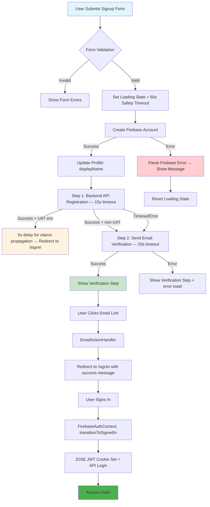
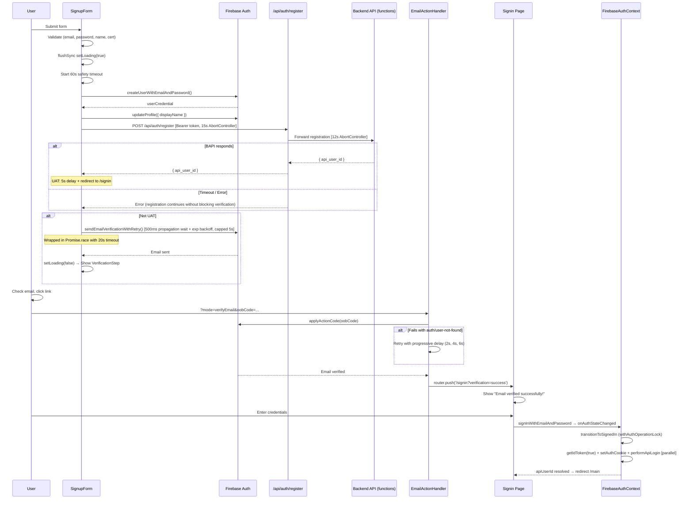
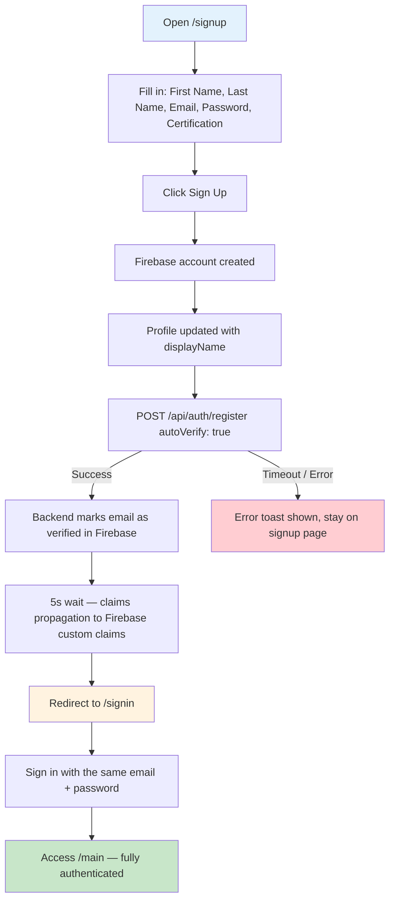

# Signup & Authentication Workflow

## Overview

The signup flow creates a Firebase account, registers the user in the backend API, sends an email verification, and then routes the user to the signin page after verification. It integrates directly with the same auth context and cookie system as signin.

## Signup Flow Architecture

### High-Level Flow Diagram



### Detailed Sequence



## Timeout Architecture

Three independent timeouts protect each stage:

| Stage                                    | Timeout | Mechanism                          | On Expiry                                   |
| ---------------------------------------- | ------- | ---------------------------------- | ------------------------------------------- |
| Entire signup process                    | 60s     | `setTimeout` safety net            | Force `setLoading(false)`, show error       |
| Frontend → `/api/auth/register`          | 15s     | `AbortController`                  | Log warning, continue to email verification |
| `/api/auth/register` → backend functions | 12s     | `AbortController`                  | Return error to frontend                    |
| Email verification send                  | 20s     | `Promise.race`                     | Show verification step with error           |
| Claims propagation (UAT)                 | 5s      | `await new Promise(resolve, 5000)` | Proceed to redirect                         |

## UAT vs Production Differences

| Behaviour            | UAT                                                             | Production                                      |
| -------------------- | --------------------------------------------------------------- | ----------------------------------------------- |
| Email verification   | **Skipped** — backend auto-verifies via `autoVerify: true` flag | Required                                        |
| Post-registration    | 5s delay for claims propagation, then redirect to `/signin`     | Show verification step and wait for email click |
| `secure` cookie flag | `true` (HTTPS host)                                             | `true`                                          |
| Cookie domain        | undefined (no restriction)                                      | `.certestic.com`                                |

---

## UAT Tester Workflow

In UAT, email verification is completely skipped. After a successful signup you are redirected straight to `/signin` and can sign in immediately with the credentials you just created.

### UAT Flow Diagram



### Step-by-Step for Testers

1. **Navigate to `/signup`**

2. **Fill in the form**
   - First Name, Last Name
   - Email (use a unique address per test run, or reuse one if the account was deleted)
   - Password (min 6 chars)
   - Select a certification from the dropdown

3. **Click "Sign Up"**
   - The button shows a spinner immediately
   - Firebase account is created and the profile is updated
   - The backend registers the user and **automatically marks the email as verified** (`autoVerify: true`)
   - A 5-second wait allows Firebase custom claims (`api_user_id`) to propagate
   - You are redirected to `/signin` — **no email check needed**

4. **Sign in at `/signin`** with the same email and password

5. **You land on `/main`** — fully authenticated with `api_user_id` set

### What `autoVerify` Does

When `autoVerify: true` is passed to the backend registration endpoint, the Firebase Admin SDK calls `auth.updateUser(uid, { emailVerified: true })` immediately after creating the database record. This removes the email-verification gate so testers can complete the full signup→signin loop without a real email inbox.

> **Important**: `autoVerify` is only set to `true` when `isUATEnv()` returns `true`. It is `false` in production — the email verification step is always enforced for real users.

### Troubleshooting

| Symptom | Likely Cause | Fix |
|---|---|---|
| Stays on spinner for > 20s | Backend registration timed out (12s) | Check backend functions are running; retry |
| Redirected to `/signin` but signin fails | Custom claims not yet propagated | Wait 10s after redirect, then try signin again |
| "Email already in use" | Account exists from a previous test run | Use a different email or delete the account via Firebase Console |
| Stuck button after 60s | Safety timeout fired — backend unreachable | Check network / backend logs |

## Key Fixes Implemented

### 1. Loading State Management

`setLoading(false)` is called explicitly in success, error, and finally paths. `flushSync` forces the spinner to appear immediately on submit. The `isMountedRef` guard prevents state updates after component unmount.

### 2. Email Verification Race Condition

- 500ms propagation delay before first send attempt
- Exponential backoff retry: delay = `min(2^attempt × 1000ms, 5000ms)` (up to 3 retries)
- `EmailActionHandler` retries `applyActionCode` with progressive delays if `auth/user-not-found`

### 3. Sequential Execution

API registration runs first (Step 1), email verification second (Step 2). If registration fails or times out, email verification still proceeds — the user is never blocked from verifying their account.

### 4. Graceful Degradation

If API registration fails, a toast informs the user that some features may be temporarily limited, but the signup flow completes and email verification is sent.

### 5. Safety Timeout

A 60s `setTimeout` acts as a last-resort guard — even if all inner operations hang, the button is re-enabled and an error is shown. Cleared in `finally`.

### 6. CSRF Protection on Cookie Endpoints

`/api/auth-cookie/set` and `/api/auth-cookie/clear` validate the `Origin` header against an allowlist (`certestic.com`, UAT host, localhost). Requests without an `Origin` (server-to-server) are allowed through.

## File Structure

```
app/signup/
└── page.tsx                     ← Main signup form, all state and flow logic

app/api/auth/
├── register/route.ts            ← Next.js → backend proxy; rate-limited (3/hr); 12s AbortController timeout

functions/src/endpoints/api/auth/
└── register.ts                  ← Backend: create user in DB, set custom claims, return api_user_id

src/components/auth/
└── EmailActionHandler.tsx       ← Processes Firebase email action links (verifyEmail); retry logic

src/utils/
└── signup-debug.ts              ← SignupDebugger class, validateSignupForm, getFirebaseErrorMessage

src/hooks/
└── useSigninHooks.ts            ← Shared auth hooks used by both signup and signin

src/lib/
└── signin-helpers.ts            ← Shared error parsing, URL param handling, legacy state clearing

src/context/
└── FirebaseAuthContext.tsx      ← Auth state; handles post-verification signin via transitionToSignedIn
```

## Error Handling

### Firebase Account Creation Errors

| Firebase Error Code         | User Message                                            |
| --------------------------- | ------------------------------------------------------- |
| `auth/email-already-in-use` | Email in use; offers "Go to Sign In" CTA with 10s toast |
| `auth/weak-password`        | Password too weak; suggests 6+ chars with mix           |
| `auth/invalid-email`        | Invalid email format                                    |
| Network / unknown           | Generic "Signup failed" with error detail               |

### Registration / Verification Partial Failures

| Scenario                         | Behaviour                                                                                |
| -------------------------------- | ---------------------------------------------------------------------------------------- |
| API registration timeout         | Log warning, continue to email verification; show info toast after verification succeeds |
| Email verification timeout (20s) | Show verification step with error message, user can manually resend                      |
| Both fail                        | Show error, allow retry from verification step                                           |

## Security

✅ **Input Validation**: Email regex, password length min/max (6–128 chars), required fields
✅ **Firebase Token Verification**: `/api/auth/register` verifies the Bearer token via Firebase Admin before processing
✅ **Rate Limiting**: `/api/auth/register` — 3 requests / hour per IP
✅ **CSRF Protection**: Cookie endpoints (`/api/auth-cookie/set`, `/api/auth-cookie/clear`) reject unknown origins
✅ **AbortController Timeouts**: Prevents hanging fetch requests at both Next.js route and Firebase functions layers
✅ **isMountedRef Guard**: Prevents state mutations after component unmount (memory leak prevention)

## Testing Checklist

### Normal Path

- [ ] Successful signup → verification step shown immediately (button not stuck)
- [ ] UAT signup → 5s delay → redirect to `/signin` (no email required)
- [ ] Email verification link → `EmailActionHandler` → `/signin?verification=success`
- [ ] Signin after verification → `/main`

### Error Paths

- [ ] Duplicate email → toast with "Go to Sign In" button
- [ ] Weak password → toast with guidance
- [ ] Backend API timeout → warning toast; verification step still shown
- [ ] Email send failure → verification step shown with error; resend button works
- [ ] 60s safety timeout fires → button re-enabled, error shown

### Edge Cases

- [ ] Navigate away during signup (component unmount) → no state errors in console
- [ ] Resend verification email → success / error toast
- [ ] Email verification link for newly created account → retry logic handles `auth/user-not-found`
- [ ] Rapid form submits → loading state prevents double-submit

## Monitoring

Consider adding analytics events for:

1. Signup funnel step completion (firebase-signup, api-registration, email-verification)
2. Timeout rates (registration timeout, email verification timeout, safety timeout)
3. Email verification success rates
4. UAT vs production flow divergence
