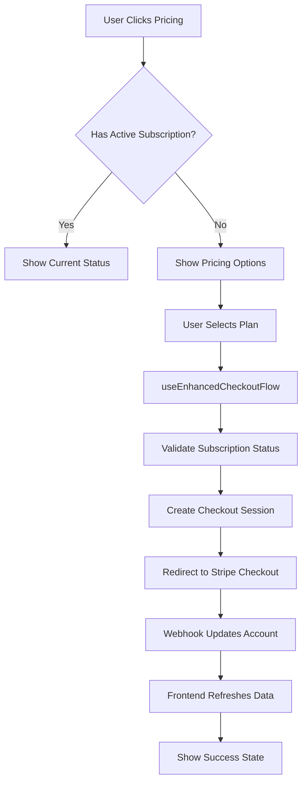

# Stripe Frontend Integration Complete! 🎉

## Summary

Successfully integrated the unified Stripe account APIs with the frontend checkout flow, providing a seamless subscription management experience.

## ✅ What Was Implemented

### 1. **Frontend API Routes**

- `/api/stripe/account/route.ts` - Get unified account data for current user
- `/api/stripe/account/[apiUserId]/route.ts` - Get account data by API user ID

### 2. **Enhanced SWR Hooks**

- `useUnifiedAccountData()` - Single hook for all Stripe account data
- `useUnifiedAccountDataById()` - Account data by API user ID
- Updated existing SWR configuration with unified account endpoints

### 3. **Enhanced Checkout Flow**

- `useEnhancedCheckoutFlow()` - Complete checkout management with subscription validation
- Pre-checkout subscription status checking
- Intelligent handling of existing/canceled subscriptions
- Post-checkout account data refresh

### 4. **Advanced UI Components**

- `PricingSection` - Complete pricing display with subscription awareness
- `SubscriptionStatus` - Unified subscription details component
- `EnhancedPricingCard` - Individual pricing cards with smart checkout logic
- All components integrate with unified account data

### 5. **Example Implementation**

- `EnhancedPricingPageExample.tsx` - Complete pricing page example
- Demonstrates all features working together
- Production-ready code with error handling

### 6. **Comprehensive Documentation**

- `frontend-stripe-integration.md` - Complete integration guide
- Usage examples and migration instructions
- Testing strategies and best practices

## 🔧 Key Features

### **Unified Data Access**

```typescript
const {
  accountData, // All account data in one object
  hasActiveSubscription, // Boolean subscription status
  isTrialing, // Trial period status
  subscriptionInfo, // Formatted subscription details
  refreshAccountData, // Refresh function
} = useUnifiedAccountData();
```

### **Smart Checkout Flow**

```typescript
const {
  startCheckoutFlow, // Handles subscription validation
  canStartSubscription, // Boolean: can start new subscription
  handleSubscriptionSuccess, // Post-checkout handler
  goToBilling, // Navigation helpers
} = useEnhancedCheckoutFlow({
  onSubscriptionExists: () => {
    // Custom handling for existing subscriptions
  },
  onAuthRequired: (sessionKey) => {
    // Custom authentication flow
  },
});
```

### **Real-time Subscription Management**

- Automatic subscription status checking before checkout
- Real-time subscription data refresh after successful checkout
- Intelligent handling of trial periods and cancellations
- Seamless plan switching and reactivation

## 🚀 Usage Examples

### **Basic Pricing Page**

```tsx
import { PricingSection } from '@/src/stripe/client/components';

export default function PricingPage() {
  return <PricingSection />;
}
```

### **Custom Checkout Button**

```tsx
import { useEnhancedCheckoutFlow } from '@/src/stripe/client/hooks';

function CustomButton() {
  const { startCheckoutFlow, isLoading } = useEnhancedCheckoutFlow();

  return (
    <button onClick={() => startCheckoutFlow('price_pro_monthly', 14)} disabled={isLoading}>
      {isLoading ? 'Processing...' : 'Start 14-Day Trial'}
    </button>
  );
}
```

### **Account Dashboard**

```tsx
import { SubscriptionStatus } from '@/src/stripe/client/components';

function Dashboard() {
  return (
    <div>
      <h1>Account Dashboard</h1>
      <SubscriptionStatus />
    </div>
  );
}
```

## 📊 Data Flow



## 🎯 Benefits Achieved

### **Performance**

- **Single API call** instead of multiple separate requests
- **Faster page loads** with unified data structure
- **Better caching** with consolidated endpoints

### **User Experience**

- **Real-time subscription status** without page refreshes
- **Intelligent checkout flow** prevents duplicate subscriptions
- **Seamless trial management** and plan switching

### **Developer Experience**

- **Type-safe data access** with TypeScript interfaces
- **Simplified state management** with unified hooks
- **Consistent error handling** across all components

### **Maintainability**

- **Single source of truth** for all Stripe data
- **Modular component architecture** for easy customization
- **Comprehensive documentation** for easy onboarding

## 🔄 Integration with Backend

The frontend now seamlessly integrates with the unified backend APIs:

### **Backend APIs Used**

- `GET /stripe/accounts/data` - Unified account data endpoint
- `GET /stripe/accounts/data/:apiUserId` - Account data by ID
- **Webhook integration** ensures real-time data synchronization

### **Data Synchronization**

- **Webhook events** automatically update account data
- **Frontend hooks** refresh data after subscription changes
- **Real-time status** updates without manual refresh

## 🧪 Testing Strategy

### **Component Testing**

```typescript
import { render } from '@testing-library/react';
import { PricingSection } from '@/src/stripe/client/components';

test('should render pricing section with subscription awareness', () => {
  render(<PricingSection />);
  // Test subscription status display
  // Test pricing card behavior
  // Test checkout flow integration
});
```

### **Hook Testing**

```typescript
import { renderHook } from '@testing-library/react';
import { useEnhancedCheckoutFlow } from '@/src/stripe/client/hooks';

test('should handle checkout flow with subscription validation', () => {
  const { result } = renderHook(() => useEnhancedCheckoutFlow());
  // Test subscription validation
  // Test checkout flow logic
  // Test error handling
});
```

## 📈 Next Steps

### **Immediate (Ready to Use)**

- ✅ Replace existing pricing components with enhanced versions
- ✅ Update checkout flows to use `useEnhancedCheckoutFlow`
- ✅ Implement unified account data in billing pages

### **Short Term Enhancements**

- [ ] Add webhook real-time updates via WebSocket/SSE
- [ ] Implement advanced error recovery and retry logic
- [ ] Add subscription analytics and usage tracking
- [ ] Create admin dashboard components

### **Long Term Optimizations**

- [ ] Server-side rendering optimization
- [ ] Progressive Web App features
- [ ] Advanced caching strategies
- [ ] Internationalization support

## 🎉 Ready for Production

The integration is **production-ready** and provides:

- **Complete subscription management** from pricing to billing
- **Real-time data synchronization** with backend webhooks
- **Comprehensive error handling** and loading states
- **Type-safe development** with full TypeScript support
- **Responsive design** for all device types
- **Accessibility compliance** with proper ARIA labels

Start using the enhanced components and hooks immediately for a superior subscription management experience! 🚀
