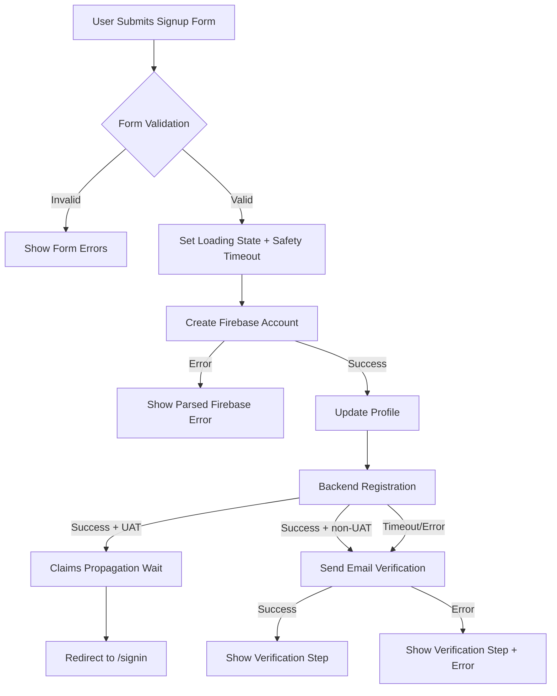

# Signup Workflow

> **Source of truth**: `app/signup/page.tsx`, `src/components/auth/EmailActionHandler.tsx`, `app/api/auth/register/route.ts`, `src/lib/auth-verification-state.ts`
> **Last reviewed**: 2026-05-25
> **Owner**: engineering

## Purpose

Documents the operational signup lifecycle, email verification handling, environment differences (UAT vs production), and troubleshooting. This is the procedural companion to [`auth-patterns.md`](auth-patterns.md), which retains invariant/security rules.

## Key Concepts

- **Two-step signup progression**: backend registration followed by verification flow.
- **Safety timeout**: hard timeout to avoid indefinite loading.
- **Graceful degradation**: registration or verification failures should not deadlock UI state.
- **UAT `autoVerify` path**: bypasses email click loop in UAT only.

## Signup Flow Architecture

### High-Level Flow

### Detailed Sequence

1. Validate signup form input.
2. Create Firebase account and update profile display name.
3. Call `/api/auth/register` with timeout protection.
4. If non-UAT, send verification email with retry/timeout handling.
5. User verifies via link handled by email action handler.
6. Redirect to `/signin?verification=success` and continue normal signin flow.

## Timeout Architecture

| Stage                            | Timeout | Mechanism       | Behavior on expiry                     |
| -------------------------------- | ------- | --------------- | -------------------------------------- |
| Entire signup interaction        | 60s     | safety timeout  | clear loading + show error             |
| Frontend to `/api/auth/register` | 15s     | AbortController | continue flow with warning             |
| Route to backend registration    | 12s     | AbortController | surface route error                    |
| Verification email send          | 20s     | Promise race    | show verification state + retry option |
| UAT claims propagation           | 5s      | fixed wait      | then redirect                          |

## Environment Differences

| Behavior                       | UAT                            | Production                          |
| ------------------------------ | ------------------------------ | ----------------------------------- |
| Email verification requirement | skipped via `autoVerify: true` | required                            |
| Post-registration user path    | delay then direct `/signin`    | verification-step then email action |
| Cookie security                | secure on HTTPS hosts          | secure + production domain policy   |

## UAT Tester Workflow

1. Submit signup form with required fields.
2. Backend registers and marks email as verified (UAT only).
3. Wait for claims propagation delay.
4. Redirect to `/signin`.
5. Sign in and access `/main`.

### `autoVerify` behavior

`autoVerify` is UAT-only and should never be enabled for production signup behavior.

## Implementation Safeguards

### Loading state management

- Always release loading in success/error/finally paths.
- Prevent post-unmount state writes.

### Email verification race handling

- Introduce short propagation delay before first send.
- Retry with bounded exponential backoff.
- Retry verification action if account propagation delay causes transient user-not-found.

### Sequential execution and graceful degradation

- Registration should run before verification send.
- Registration failure should not permanently block verification UX.

### Safety timeout

- Force unlock UX when long-tail hangs occur.

### CSRF checks on cookie endpoints

- Validate origin allowlist for browser-origin calls.

## File Reference

- `app/signup/page.tsx`
- `src/components/auth/EmailActionHandler.tsx`
- `app/api/auth/register/route.ts`
- `functions/src/endpoints/api/auth/register.ts`
- `src/utils/signup-debug.ts`
- `src/context/FirebaseAuthContext.tsx`

## Error Handling

### Firebase account creation errors

| Firebase error              | User-facing behavior              |
| --------------------------- | --------------------------------- |
| `auth/email-already-in-use` | prompt sign-in route              |
| `auth/weak-password`        | prompt stronger password          |
| `auth/invalid-email`        | prompt valid email                |
| network/unknown             | generic fallback + retry guidance |

### Registration / verification partial failures

| Scenario                  | Expected behavior                          |
| ------------------------- | ------------------------------------------ |
| registration timeout      | continue to verification path with warning |
| verification send timeout | show verification state and retry options  |
| both unstable             | no deadlock; user can retry from UI        |

## Monitoring and Observability

Track at minimum:

1. Signup funnel completion stages.
2. Timeout frequency by stage.
3. Verification success rate.
4. UAT vs production divergence.

## Testing Checklist

### Normal path

- [ ] Signup creates account and reaches verification flow
- [ ] Verification link succeeds and redirects to signin
- [ ] Verified user signin reaches `/main`
- [ ] UAT flow bypasses email click and redirects to signin

### Error path

- [ ] Duplicate email handling is actionable
- [ ] Weak password messaging is clear
- [ ] Registration timeout leaves retriable state
- [ ] Verification send timeout leaves retriable state

### Edge cases

- [ ] Component unmount during signup does not throw state update warnings
- [ ] Resend verification behaves correctly
- [ ] Rapid submit attempts do not break flow

## Troubleshooting

### Stuck spinner or loading state

- Inspect registration timeout path and safety-timeout branch.

### Verification link fails for new accounts

- Verify retry behavior around action-code handling.

### UAT signin fails after redirect

- Check claims propagation timing and retry signin after short delay.

## Related Docs

- [Auth Patterns](auth-patterns.md)
- [Signin Workflow](signin-workflow.md)
- [API Connection](../api/api-connection.md)
