# Comprehensive Signin & Authentication System Documentation

## Overview

The certifai authentication system is a modern Firebase Auth implementation with JWT token management, custom claims integration, and intelligent state management. This system provides both client-side and server-side authentication with a clean, streamlined flow that seamlessly integrates with the signup process.

## Architecture

### Core Components

1. **Firebase Authentication**: Primary authentication provider with email verification requirement
2. **JWT Token Management**: JOSE JWT wrapper containing Firebase tokens for server-side validation
3. **Custom Claims Integration**: Stores `api_user_id` from backend API in Firebase custom claims
4. **Intelligent State Management**: Smart auth state handling with race condition prevention
5. **Route Protection**: AuthGuard with timeout handling and middleware protection
6. **Middleware Protection**: Server-side route protection for `/main/*` paths and signin redirection

### Signin Flow Architecture

#### High-Level Flow Diagram

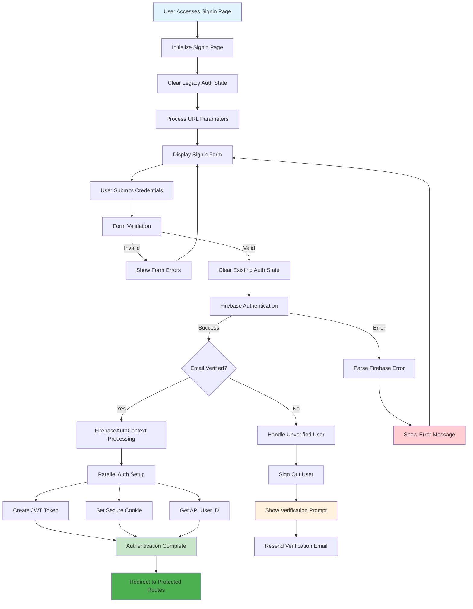

#### Component Architecture

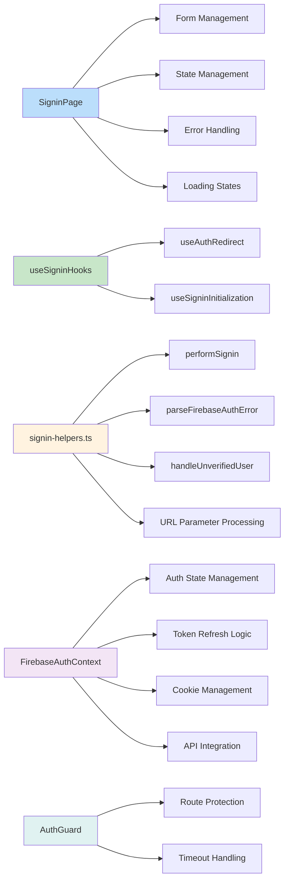

#### Detailed Implementation Flow

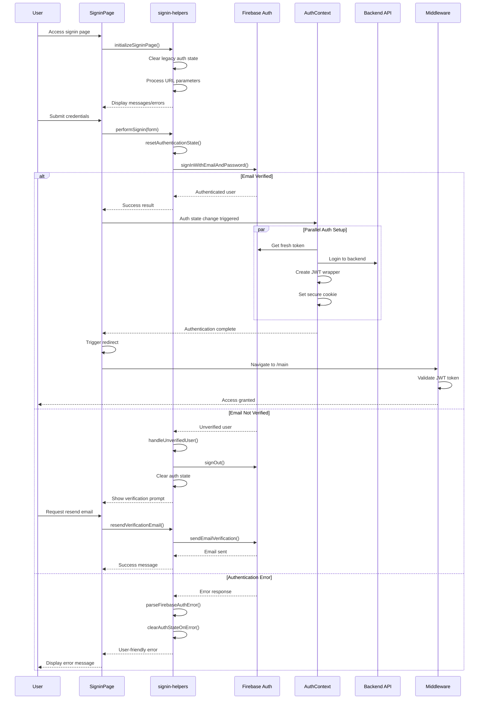

### Authentication Flow

#### Primary Flow

1. **Page Initialization**: Clear legacy auth state and process URL parameters
2. **User Authentication**: Firebase email/password authentication with email verification
3. **Parallel Auth Setup**: Simultaneous token generation, cookie setting, and API integration
4. **Token Generation**: Create JOSE JWT wrapper containing Firebase ID token
5. **Cookie Setting**: Store JWT in secure HTTP-only cookie (`authToken`)
6. **API Integration**: Get `api_user_id` from backend API and store in custom claims
7. **Route Protection**: Middleware validates JWT and Firebase token for protected routes
8. **Smart Signin Handling**: Middleware redirects authenticated users from signin page to main app

#### State Management Architecture

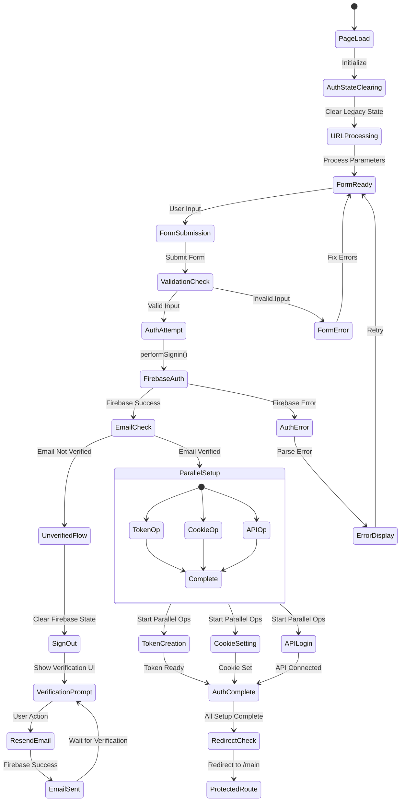

#### Token Management Flow

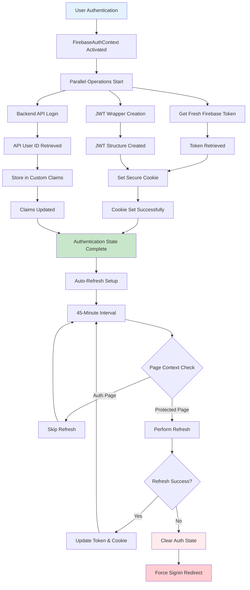

#### Token Structure

```json
{
  "token": "firebase_id_token",
  "iat": 1234567890,
  "exp": 1234571490
}
```

#### Error Handling Architecture

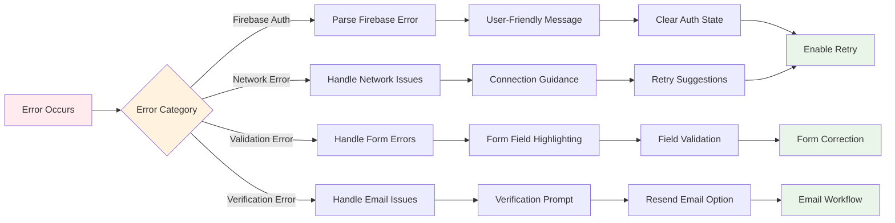

#### Middleware Integration

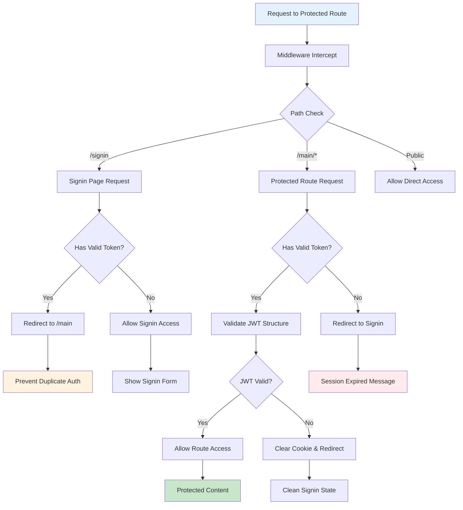

#### Simplified Middleware Flow

**For `/signin` path**:

- **Valid token**: Redirect to `/main` (prevents duplicate signin)
- **Invalid/No token**: Allow access to signin page
- **Expired token**: Clear cookie and allow signin page access

**For `/main/*` paths**:

- **Valid token**: Allow access to protected content
- **Invalid/No token**: Redirect to signin with session_expired error
- **Expired token**: Redirect to signin with session_expired error

### Integration with Signup Flow

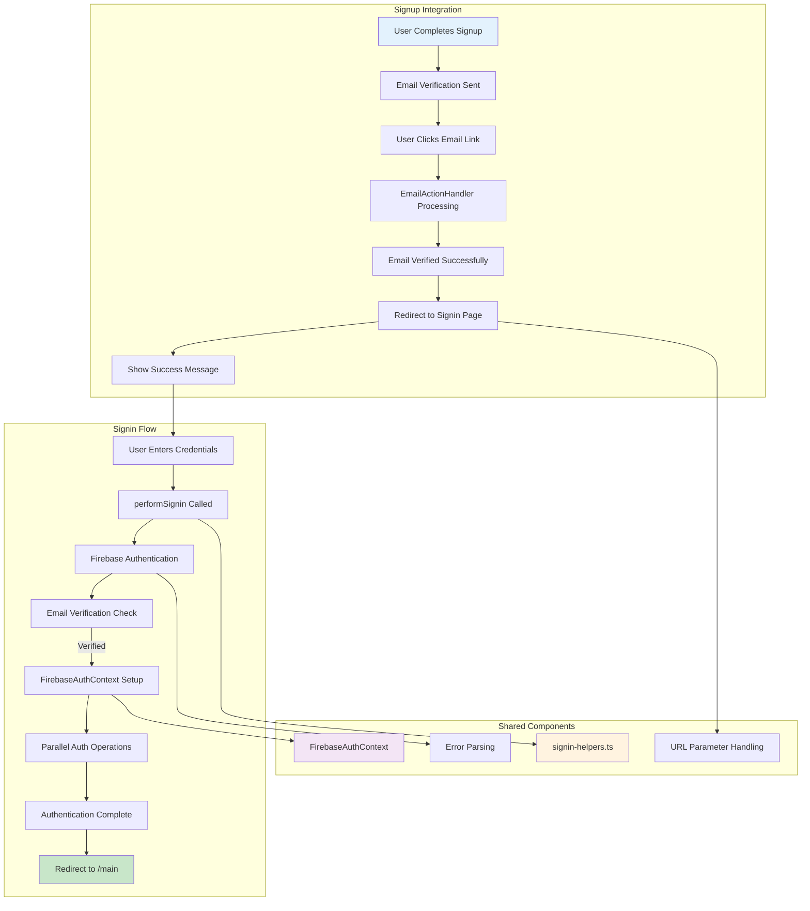

## Key Features & Implementation Details

### 1. Modern Signin Flow with Race Condition Prevention

**Implementation**:

- Intelligent page initialization with legacy auth state clearing
- Form validation with real-time error clearing
- Parallel authentication operations for optimal performance
- Smart redirect logic that prevents navigation loops

**Key Functions**:

```typescript
// Core signin operation
const result = await performSignin(form);

// Parallel auth setup in FirebaseAuthContext
await Promise.all([
  createJWTToken(firebaseUser),
  setSecureCookie(jwtToken),
  getApiUserId(firebaseUser),
]);
```

**Files**:

- `src/lib/signin-helpers.ts` - Core signin operations and error handling
- `src/hooks/useSigninHooks.ts` - React hooks for signin functionality
- `app/signin/page.tsx` - Modern signin page implementation

### 2. Firebase Auth with Advanced State Management

**Implementation**:

- Email/password authentication with strict email verification requirement
- Custom claims store `api_user_id` from backend API
- Intelligent token refresh with context-aware timing
- Automatic auth state clearing on refresh failures

**Smart Token Refresh**:

```typescript
// Prevents refresh during auth pages to avoid race conditions
const isAuthPage =
  currentPath.includes('/signin') ||
  currentPath.includes('/signup') ||
  currentPath.includes('/forgot-password');

if (isAuthPage) {
  console.log('Skipping token refresh - user is on auth page');
  return firebaseToken;
}
```

**Files**:

- `src/context/FirebaseAuthContext.tsx` - Enhanced auth context with intelligent refresh
- `src/lib/auth-claims.ts` - Custom claims utilities
- `app/api/auth/set-claims/route.ts` - Sets custom claims
- `src/hooks/useApiUserId.ts` - React hook for accessing claims

### 3. Enhanced JWT Token Security

**Features**:

- Simplified JWT structure for better performance
- Secure HTTP-only cookies with proper cleanup
- Context-aware token refresh (skips during auth flows)
- Force signin on refresh failures to maintain security

**Smart Refresh Logic**:

```typescript
// Auto-refresh every 45 minutes, but skip during auth flows
useEffect(() => {
  if (!firebaseUser || !shouldSetupRefresh()) return;

  const interval = setInterval(async () => {
    if (isOnAuthPage()) {
      console.log('Skipping refresh - user on auth page');
      return;
    }
    await refreshToken();
  }, 45 * 60 * 1000); // 45 minutes

  return () => clearInterval(interval);
}, [firebaseUser, refreshToken]);
```

**Files**:

- `middleware.ts` - Enhanced route protection and smart signin redirection
- `app/api/auth-cookie/set/route.ts` - JWT creation and cookie setting
- `app/api/auth-cookie/verify/route.ts` - Token verification
- `src/lib/auth-setup.ts` - Authentication setup utilities

### 4. Advanced Authentication Context

**Implementation**:

- Centralized Firebase auth state management with race condition prevention
- Parallel authentication setup (cookie + API login + custom claims)
- Intelligent token refresh with context awareness
- Clean error handling with forced signin on failures

**Race Condition Prevention**:

```typescript
// Prevent multiple simultaneous auth operations
const [authSetupInProgress, setAuthSetupInProgress] = useState(false);

const handleAuthStateChange = useCallback(
  async (user: User | null) => {
    if (authSetupInProgress) {
      console.log('Auth setup already in progress, skipping...');
      return;
    }

    if (user) {
      setAuthSetupInProgress(true);
      try {
        await performAuthSetup(user);
      } finally {
        setAuthSetupInProgress(false);
      }
    }
  },
  [authSetupInProgress],
);
```

**Files**:

- `src/context/FirebaseAuthContext.tsx` - Enhanced auth context with intelligent features
- `src/lib/auth-setup.ts` - Authentication setup utilities with parallel operations

### 5. Comprehensive Error Handling System

**Features**:

- Firebase error parsing with user-friendly messages
- Network error detection and guidance
- Email verification error handling with resend capability
- Automatic auth state clearing on errors

**Error Categories**:

```typescript
// Network and timeout errors
if (error.message?.includes('signal is aborted')) {
  return 'Request timed out. Please check your connection and try again.';
}

// Firebase-specific errors
switch (error.code) {
  case 'auth/user-not-found':
  case 'auth/wrong-password':
    return 'Invalid email or password.';
  case 'auth/too-many-requests':
    return 'Too many failed attempts. Please try again later.';
}
```

**Files**:

- `src/lib/signin-helpers.ts` - Comprehensive error parsing and handling
- `app/signin/page.tsx` - Error display and user guidance

### 6. Route Protection System

**Features**:

- AuthGuard with intelligent timeout handling for user ID loading
- Emergency timeout with clean error messaging
- Simple authentication state management
- Session expiration handling with clean redirects

**Protection Layers**:

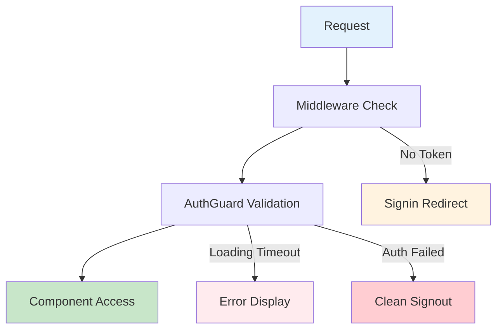

**Files**:

- `src/components/custom/AuthGuard.tsx` - Route protection with timeout handling
- `middleware.ts` - Server-side route protection
- `src/components/custom/PageLoader.tsx` - Clean loading interface

### 7. Performance Optimization & Debugging

**Features**:

- Parallel authentication operations for faster signin
- Intelligent token refresh timing to prevent race conditions
- Conditional Firebase provider for public pages
- Comprehensive error logging and state tracking

**Performance Patterns**:

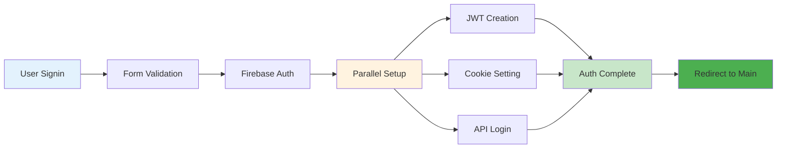

**Debug & Monitoring**:

```typescript
// Comprehensive logging throughout signin flow
console.log('Signin successful, auth context will handle cookie setup');
console.log('Authentication successful, initiating redirect to /main');
console.log('Skipping token refresh - user is on auth page:', currentPath);
```

**Files**:

- `src/components/auth/ConditionalFirebaseAuthProvider.tsx` - Conditional auth provider
- `src/lib/auth-setup.ts` - Performance-optimized auth setup
- All signin-related files include comprehensive logging

## File Structure

### Core Authentication Files

```
src/
├── context/
│   └── FirebaseAuthContext.tsx           # Main auth context with state management
├── lib/
│   ├── auth-setup.ts                     # Authentication setup utilities
│   ├── auth-claims.ts                    # Custom claims utilities
│   ├── auth-utils.ts                     # General auth utilities
│   ├── server-auth-strategy.ts           # Server-side auth validation
│   ├── service-only.ts                   # Server-side token management
│   ├── signin-helpers.ts                 # Signin flow utilities
│   └── jwt-utils.ts                      # JWT helper functions
├── hooks/
│   ├── useApiUserId.ts                   # React hook for api_user_id access
│   └── useSigninHooks.ts                 # Simplified signin hooks
├── components/
│   ├── auth/
│   │   └── ConditionalFirebaseAuthProvider.tsx  # Conditional auth provider
│   └── custom/
│       ├── AuthGuard.tsx                 # Route protection with timeout
│       └── PageLoader.tsx                # Clean loading interface
└── swr/
    └── useAuthSWR.ts                     # SWR with authentication
```

### API Routes

```
app/api/
├── auth/
│   ├── login/route.ts                    # Backend API login
│   ├── register/route.ts                 # User registration
│   ├── set-claims/route.ts               # Sets Firebase custom claims
│   └── clear-cache/route.ts              # Emergency cache clearing
└── auth-cookie/
    ├── set/route.ts                      # JWT creation and cookie setting
    ├── clear/route.ts                    # Cookie clearing
    ├── refresh/route.ts                  # Token refresh
    ├── verify/route.ts                   # Token verification
    ├── server-refresh/route.ts           # Server-side token refresh
    └── clear-cache/route.ts              # Cache clearing
```

### Layout and Middleware

```
middleware.ts                             # Route protection for /main/* paths and signin redirection
app/
├── layout.tsx                           # Root layout
├── main/layout.tsx                      # Protected routes with AuthGuard
└── signin/page.tsx                      # Authentication page
```

## Usage Examples

### 1. Using Firebase Auth Context

```tsx
import { useFirebaseAuth } from '@/src/context/FirebaseAuthContext';

function MyComponent() {
  const { firebaseUser, apiUserId, loading } = useFirebaseAuth();

  if (loading) return <div>Loading...</div>;
  if (!firebaseUser) return <div>Please sign in</div>;

  return <div>Welcome {firebaseUser.email}!</div>;
}
```

### 2. Accessing API User ID

```tsx
import { useApiUserId } from '@/src/hooks/useApiUserId';

function ProfileComponent() {
  const { apiUserId, loading } = useApiUserId();

  if (loading) return <div>Loading...</div>;
  if (!apiUserId) return <div>API User ID not available</div>;

  return <div>API User ID: {apiUserId}</div>;
}
```

### 3. Server-Side Authentication

```tsx
import { getServerAuthState } from '@/src/lib/server-auth-strategy';

export default async function ProtectedPage() {
  const authState = await getServerAuthState();

  if (!authState.isAuthenticated) {
    redirect('/signin');
  }

  return <div>Protected content</div>;
}
```

### 4. Using AuthGuard

```tsx
import AuthGuard from '@/src/components/custom/AuthGuard';

export default function ProtectedLayout({ children }) {
  return <AuthGuard>{children}</AuthGuard>;
}
```

### 5. Emergency Recovery

```tsx
// In case of authentication issues, AuthGuard provides clean error handling
// Authentication state is automatically cleared when needed
```

## Security Features

### Token Management

- JOSE JWT wrapper containing Firebase ID token
- Simplified JWT structure for better performance
- Secure HTTP-only cookies with proper expiration
- Smart signin redirection for authenticated users

### Authentication Security

- Email verification requirement
- Server-side token validation using Firebase Admin SDK
- Middleware protection for all `/main/*` routes
- Smart signin page handling to prevent duplicate authentication
- Automatic cleanup of invalid authentication state

### Error Prevention

- Request timeout handling (10 seconds for auth setup, 5 seconds for API user ID)
- Clean timeout mechanisms with proper error messaging
- Graceful fallback when API is unavailable
- Comprehensive error logging

## Testing

### Manual Testing

1. **Authentication Flow**: Sign up → Email verification → Sign in → Access protected routes
2. **Token Security**: Verify JWT structure includes `jti` field
3. **Emergency Recovery**: Simulate stuck states and verify recovery options
4. **Route Protection**: Test middleware protection on `/main/*` paths

### Key Test Cases

- Email verification requirement
- Smart signin redirection for authenticated users
- Emergency timeout handling
- Conditional Firebase provider behavior
- Server-side authentication validation
- Middleware handling of both signin and protected routes

## Troubleshooting

### Common Issues & Solutions

**Email Verification Required**:

- **Symptom**: User can't sign in after registration
- **Solution**: Check email and click verification link
- **Prevention**: Clear messaging about email verification requirement
- **Debug**: Check `firebaseUser.emailVerified` status

**Stuck on Loading/Race Conditions**:

- **Symptom**: AuthGuard shows loading for extended periods or auth loops
- **Solution**: Automatic timeout handling with intelligent refresh prevention
- **Technical**: Context-aware token refresh skips auth pages, 20-second emergency timeout
- **Debug**: Check browser console for "Skipping token refresh" messages

**Duplicate Signin Prevention**:

- **Symptom**: User with valid session tries to access signin page
- **Solution**: Middleware automatically redirects to `/main` page
- **Prevention**: Smart middleware handling prevents confusion and duplicate authentication
- **Debug**: Check network tab for redirect responses

**Legacy Token Issues**:

- **Symptom**: Users redirected to signin unexpectedly
- **Solution**: System automatically clears invalid tokens and forces fresh signin
- **Prevention**: Simplified token structure with proper validation
- **Debug**: Check Application tab in DevTools for `authToken` cookie

**Auth State Race Conditions**:

- **Symptom**: Multiple auth operations causing conflicts
- **Solution**: `authSetupInProgress` flag prevents concurrent operations
- **Prevention**: Intelligent state management in FirebaseAuthContext
- **Debug**: Look for "Auth setup already in progress" console messages

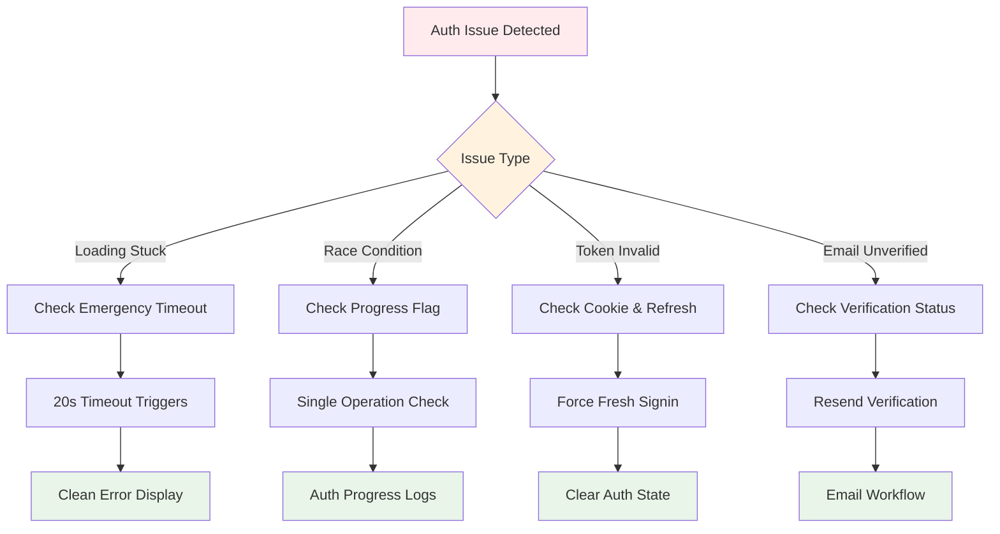

**Middleware Errors**:

- **Symptom**: 401 errors on protected routes or signin redirect loops
- **Solution**: Check cookie presence, JWT structure, and middleware logs
- **Debug**: Enable middleware logging for detailed error messages
- **Prevention**: Proper JWT structure validation and cookie management

### Debug Flow Chart

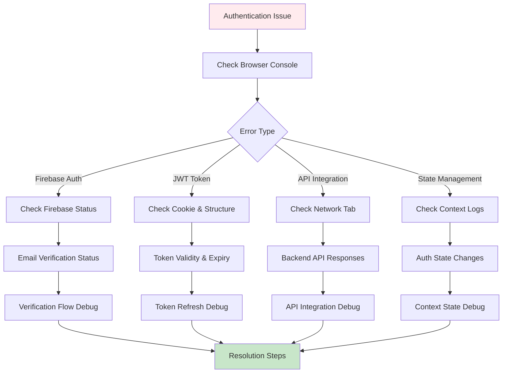

### Developer Tools

**Auth State Check**: `getServerAuthState()`
**Token Verification**: `/api/auth-cookie/verify`
**Cache Clearing**: `/api/auth/clear-cache`

## Configuration

### Environment Variables

```bash
JOSE_JWT_SECRET=your-jwt-secret
NEXT_PUBLIC_FIREBASE_BACKEND_URL=your-backend-url
FIREBASE_PROJECT_ID=your-project-id
FIREBASE_PRIVATE_KEY=your-private-key
FIREBASE_CLIENT_EMAIL=your-client-email
```

### Firebase Setup

- Email/password authentication enabled
- Email verification required
- Custom claims support configured
- Admin SDK properly initialized

## Migration Notes

### From Previous Versions

- Simplified middleware with smart signin handling
- Enhanced token validation without complex legacy support
- Streamlined authentication flow with better user experience
- Automatic redirection for authenticated users accessing signin page

### Future Considerations

- Consider implementing refresh token rotation
- Add support for additional authentication providers
- Implement rate limiting for authentication attempts
- Add comprehensive audit logging

## Benefits of Current Implementation

### Code Quality

- **Race Condition Prevention**: Intelligent auth state management prevents concurrent operations
- **Better Performance**: Parallel authentication setup and context-aware token refresh
- **Cleaner Flow**: Streamlined signin process with smart redirection and error handling
- **Maintainable**: Modular architecture with clear separation of concerns
- **Reliable**: Robust error handling with automatic recovery mechanisms

### User Experience

- **Faster Authentication**: Parallel operations reduce signin time
- **Smart Redirection**: Context-aware redirects prevent confusion and loops
- **Clear Error Messages**: User-friendly error parsing with actionable guidance
- **Seamless Integration**: Unified flow with signup process for consistent experience
- **Responsive Design**: Quick validation with appropriate loading states and timeouts

### Security Features

- **Enhanced Token Management**: Context-aware refresh prevents race conditions
- **Forced Signin on Failures**: Invalid tokens trigger clean auth state reset
- **Secure Cookie Handling**: HTTP-only cookies with proper expiration
- **Email Verification Enforcement**: Strict requirement prevents unverified access
- **Middleware Protection**: Server-side validation for all protected routes

### Developer Experience

- **Comprehensive Logging**: Detailed console output for debugging
- **Modular Architecture**: Reusable helpers and hooks across auth flows
- **Type Safety**: Full TypeScript integration with proper error types
- **Testing Support**: Clear error states and predictable behavior
- **Documentation**: Extensive inline comments and flow documentation

### Performance Optimizations

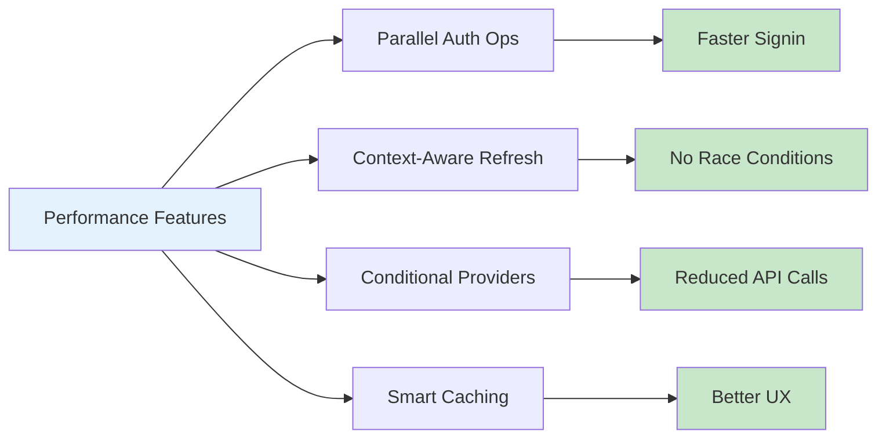

## Integration Benefits

### Unified Authentication System

The signin system seamlessly integrates with the signup flow to provide:

- **Consistent Error Handling**: Shared error parsing utilities across both flows
- **Unified State Management**: Single FirebaseAuthContext manages all auth states
- **Seamless User Journey**: From signup verification to signin completion
- **Shared Components**: Reusable authentication utilities and hooks
- **Consistent UI/UX**: Matching design patterns and user feedback

### Future-Proof Architecture

The current implementation provides a solid foundation for:

- **Additional Auth Providers**: Easy integration of OAuth providers
- **Enhanced Security**: Ready for 2FA and advanced security features
- **Scalability**: Modular design supports growing user base
- **Monitoring**: Built-in logging supports analytics and debugging
- **Maintenance**: Clear separation of concerns simplifies updates

This documentation reflects the current comprehensive implementation of the certifai signin system as of July 2025, showcasing a modern, reliable, and user-friendly authentication experience.
