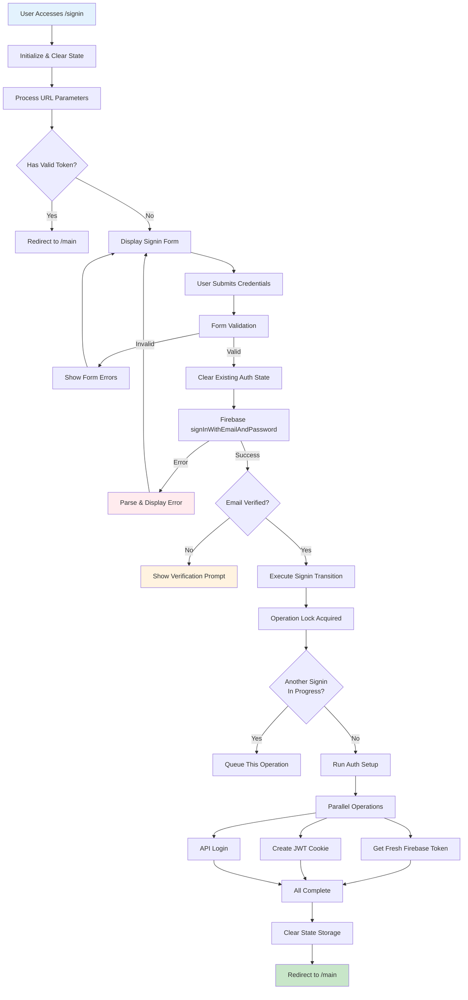
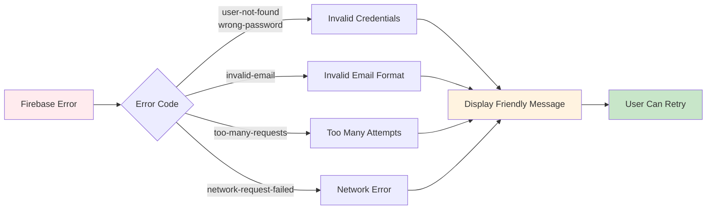
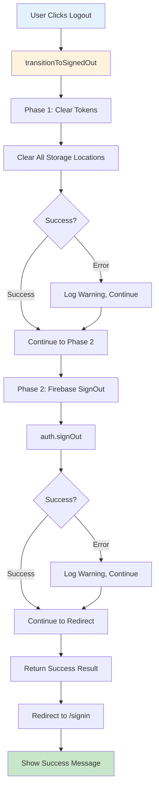
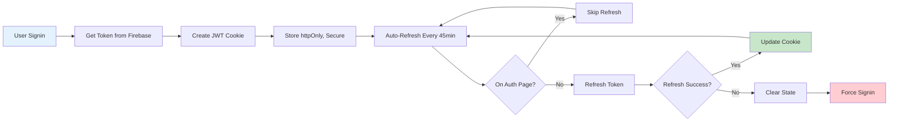
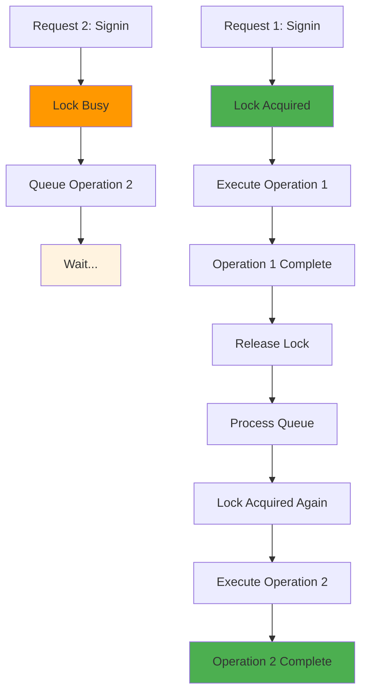
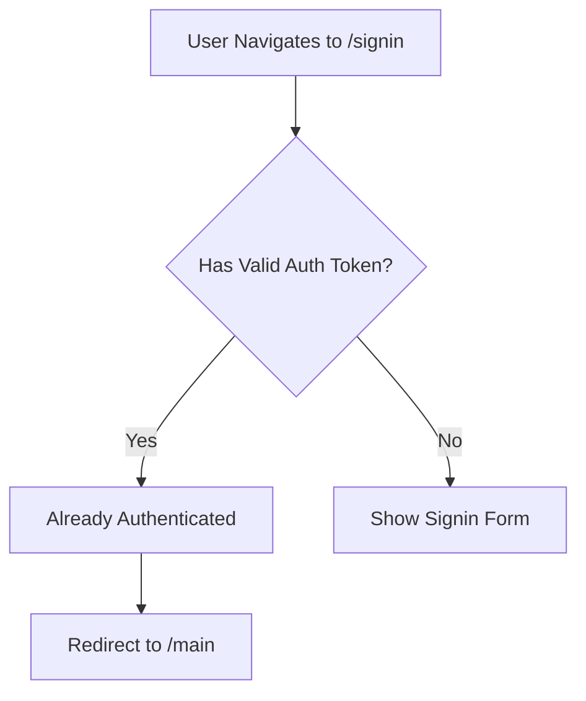
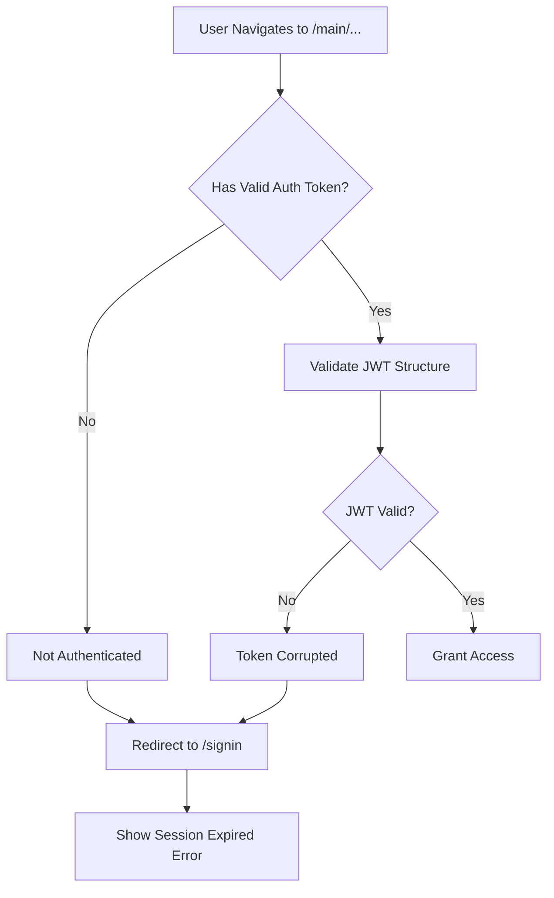

# Authentication System Documentation

## Overview

The certifai authentication system uses Firebase Auth with JWT token management, custom claims integration, and intelligent state management. It provides a secure, streamlined flow with race condition prevention and explicit state tracking.

## Core Architecture

### Key Components

1. **Firebase Authentication**: Email/password auth with email verification requirement
2. **JWT Token Management**: Secure HTTP-only cookies containing Firebase tokens
3. **Custom Claims**: Stores `api_user_id` from backend API in Firebase custom claims
4. **Intelligent State Management**: Unified token clearing, explicit state transitions, race condition prevention
5. **Route Protection**: AuthGuard with timeout handling and middleware protection
6. **Token Refresh**: Context-aware auto-refresh (45 minutes) that skips auth pages

---

## Signin Flow

### Complete Signin Process


```mermaid
graph TD
    A[User Accesses /signin] --> B[Initialize & Clear State]
    B --> C[Process URL Parameters]
    C --> D{Has Valid Token?}

    D -->|Yes| E[Redirect to /main]
    D -->|No| F[Display Signin Form]

    F --> G[User Submits Credentials]
    G --> H[Form Validation]
    H -->|Invalid| I[Show Form Errors]
    I --> F

    H -->|Valid| J[Clear Existing Auth State]
    J --> K[Firebase signInWithEmailAndPassword]

    K -->|Error| L[Parse & Display Error]
    L --> F

    K -->|Success| M{Email Verified?}
    M -->|No| N[Show Verification Prompt]
    M -->|Yes| O[Execute Signin Transition]

    O --> P[Operation Lock Acquired]
    P --> Q{Another Signin\nIn Progress?}
    Q -->|Yes| R[Queue This Operation]
    Q -->|No| S[Run Auth Setup]

    S --> T[Parallel Operations]
    T --> U[Get Fresh Firebase Token]
    T --> V[Create JWT Cookie]
    T --> W[API Login]

    U --> X[All Complete]
    V --> X
    W --> X

    X --> Y[Clear State Storage]
    Y --> Z[Redirect to /main]

    style A fill:#e3f2fd
    style Z fill:#c8e6c9
    style N fill:#fff3e0
    style L fill:#ffebee
```

### Step-by-Step Explanation

**1. Page Initialization**

- Clears any legacy auth state (scattered localStorage keys)
- Processes URL parameters (error, message, verification status)
- If user has valid token → redirect to `/main`

**2. Form Submission**

- Validates email format and password strength
- Shows inline errors if validation fails

**3. Firebase Authentication**

- Calls `signInWithEmailAndPassword()` with credentials
- If error → parse Firebase error code and show user-friendly message
- If success → check if email is verified

**4. Verification Check**

- If email NOT verified → sign out and show resend verification prompt
- If email verified → proceed to auth setup

**5. Signin Transition (with Race Condition Prevention)**

- `withAuthOperationLock()` acquires a lock
- If another signin is in progress → queue this operation
- Otherwise → execute auth setup immediately

**6. Parallel Auth Setup**

- **Get Fresh Firebase Token**: `authUser.getIdToken(true)` - Forces fresh token
- **Create JWT Cookie**: Call `/api/auth-cookie/set` with Firebase token
- **API Login**: Call `/api/auth/login` to get `api_user_id`
- All 3 operations run in parallel for speed

**7. Complete & Redirect**

- All tokens and state cleared
- Redirect to `/main` with success message

### Error Handling


```mermaid
graph LR
    A[Firebase Error] --> B{Error Code}

    B -->|user-not-found<br/>wrong-password| C[Invalid Credentials]
    B -->|invalid-email| D[Invalid Email Format]
    B -->|too-many-requests| E[Too Many Attempts]
    B -->|network-request-failed| F[Network Error]

    C --> G[Display Friendly Message]
    D --> G
    E --> G
    F --> G

    G --> H[User Can Retry]

    style A fill:#ffebee
    style G fill:#fff3e0
    style H fill:#c8e6c9
```

---

## Logout Flow

### Complete Logout Process


```mermaid
graph TD
    A[User Clicks Logout] --> B[transitionToSignedOut]

    B --> C[Phase 1: Clear Tokens]
    C --> D[Clear All Storage Locations]
    D --> E{Success?}

    E -->|Error| F[Log Warning, Continue]
    E -->|Success| G[Continue to Phase 2]
    F --> G

    G --> H[Phase 2: Firebase SignOut]
    H --> I[auth.signOut]
    I --> J{Success?}

    J -->|Error| K[Log Warning, Continue]
    J -->|Success| L[Continue to Redirect]
    K --> L

    L --> M[Return Success Result]
    M --> N[Redirect to /signin]
    N --> O[Show Success Message]

    style A fill:#e3f2fd
    style B fill:#fff3e0
    style O fill:#c8e6c9
```

### Step-by-Step Explanation

**1. Phase 1: Clear All Tokens**

- Clear `/api/auth/logout` (server-side)
- Clear `/api/auth/clear-cache` (token cache)
- Clear `localStorage`: authToken, firebaseToken, apiUserId, verification state
- Clear `sessionStorage`: Same keys as above
- Clear `document.cookie`: Multiple domain variations
- Clear browser cache for auth endpoints

**Phase 1 Result**: Included in API response as `phasesFailed` field (if there are issues)

**2. Phase 2: Firebase SignOut**

- Call `auth.signOut()` to sign user out of Firebase
- Continue even if this fails (client state already cleared)

**3. Redirect**

- Use `window.location.href` for maximum reliability
- Redirect to `/signin` with success message
- Clean URL (no verification parameters)

### Error Recovery

Even if logout encounters errors:

- API responds with HTTP 200 (success status)
- Includes `phasesFailed` field listing which phases had issues
- Client still redirects to signin
- User is always logged out even if some operations failed

### Emergency Logout

If normal logout hangs:

```typescript
emergencyLogout(); // Initiates async cleanup, redirects immediately
```

This:

- Starts token clearing asynchronously (don't wait)
- Redirects immediately to `/signin` with error message
- Ensures user gets logged out even if infrastructure fails

---

## Token Management

### Token Structure

```json
{
  "token": "firebase_id_token",
  "iat": 1234567890,
  "exp": 1234571490
}
```

### Token Lifecycle


```mermaid
graph LR
    A[User Signin] --> B[Get Token from Firebase]
    B --> C[Create JWT Cookie]
    C --> D[Store httpOnly, Secure]

    D --> E[Auto-Refresh Every 45min]
    E --> F{On Auth Page?}
    F -->|Yes| G[Skip Refresh]
    F -->|No| H[Refresh Token]

    H --> I{Refresh Success?}
    I -->|Yes| J[Update Cookie]
    I -->|No| K[Clear State]
    K --> L[Force Signin]

    J --> E
    G --> E

    style A fill:#e3f2fd
    style J fill:#c8e6c9
    style L fill:#ffcdd2
```

### Why Skip Refresh During Auth Pages?

- Prevents race conditions when signin/signup pages are changing auth state
- User is not authenticated yet on auth pages
- Refresh would conflict with signin operation

---

## State Management

### Type-Safe State Machine

Auth state is now explicit (not implicit):

```typescript
enum AuthState {
  NotAuthenticated = 'not-authenticated',
  Authenticating = 'authenticating',
  Authenticated = 'authenticated',
  SessionExpired = 'session-expired',
  Error = 'error',
}

// Valid transitions:
// NotAuthenticated → Authenticating → Authenticated
// Authenticated → SessionExpired → NotAuthenticated
// Any state → Error
```

### Unified Token Clearing

Before (scattered across 4 locations):

```typescript
localStorage.removeItem('firebaseToken');
sessionStorage.removeItem('firebaseToken');
document.cookie = 'authToken=; expires=...';
await fetch('/api/auth/clear-cache');
```

After (single unified call):

```typescript
import { clearAuthTokens } from '@/src/lib/auth-state-manager';
await clearAuthTokens('all'); // All clearing operations
```

Scopes:

- `'all'` - Everything (APIs, localStorage, sessionStorage, cookies, cache)
- `'client'` - Only localStorage/sessionStorage
- `'cookies'` - Only document.cookie
- `'storage'` - Only localStorage/sessionStorage

### Verification State

Before (5 scattered keys):

```typescript
localStorage.setItem('showVerificationStep', 'true');
localStorage.setItem('verificationLoading', 'false');
localStorage.setItem('emailVerificationSent', 'true');
sessionStorage.setItem('verificationLoading', 'false');
// etc...
```

After (centralized API):

```typescript
import {
  setVerificationEmailSent,
  getVerificationState,
  clearVerificationState,
} from '@/src/lib/auth-verification-state';

setVerificationEmailSent(email);
const state = getVerificationState(); // Single object
clearVerificationState(); // All keys cleared
```

---

## Race Condition Prevention

### The Problem

Without protection:

```
Click signin → Request 1 starts
Click signin again → Request 2 starts (concurrent!)
Request 1 finishes → Sets apiUserId
Request 2 finishes → Overwrites with different value
Result: State mixing, wrong user data
```

### The Solution

Operation locking with queue:


```mermaid
graph TD
    A[Request 1: Signin] --> B[Lock Acquired]
    B --> C[Execute Operation 1]

    D[Request 2: Signin] --> E[Lock Busy]
    E --> F[Queue Operation 2]
    F --> G[Wait...]

    C --> H[Operation 1 Complete]
    H --> I[Release Lock]
    I --> J[Process Queue]
    J --> K[Lock Acquired Again]
    K --> L[Execute Operation 2]

    L --> M[Operation 2 Complete]

    style B fill:#4caf50
    style E fill:#ff9800
    style G fill:#fff3e0
    style M fill:#4caf50
```

How it works:

1. First signin acquires lock
2. Second signin while locked → queued
3. First signin completes
4. Queued signin automatically runs
5. Only one operation at a time = consistent state

---

## Route Protection

### Signin Page (/signin)


```mermaid
graph TD
    A[User Navigates to /signin] --> B{Has Valid Auth Token?}

    B -->|Yes| C[Already Authenticated]
    C --> D[Redirect to /main]

    B -->|No| E[Show Signin Form]
```

### Protected Routes (/main/\*)


```mermaid
graph TD
    A[User Navigates to /main/...] --> B{Has Valid Auth Token?}

    B -->|No| C[Not Authenticated]
    C --> D[Redirect to /signin]
    D --> E[Show Session Expired Error]

    B -->|Yes| F[Validate JWT Structure]
    F --> G{JWT Valid?}

    G -->|No| H[Token Corrupted]
    H --> D

    G -->|Yes| I[Grant Access]
```

---

## Error Types & Handling

### Firebase Errors (Typed)

```typescript
enum AuthErrorType {
  InvalidCredentials = 'invalid-credentials',
  NetworkError = 'network-error',
  SessionExpired = 'session-expired',
  EmailNotVerified = 'email-not-verified',
  TooManyAttempts = 'too-many-attempts',
  Unknown = 'unknown',
}

// Type-safe parsing
const typedError = parseFirebaseErrorToTypedError(code, message);
// typedError.type is now an enum, not a string
// typedError.userFacingMessage is pre-formatted
```

### Common Errors & Recovery

| Error                     | Cause                               | Recovery                          |
| ------------------------- | ----------------------------------- | --------------------------------- |
| Invalid email or password | User typed wrong credentials        | Retry signin                      |
| Too many failed attempts  | Rate limiting after failures        | Wait 15 min or use password reset |
| Network error             | Connection issue                    | Check internet, retry             |
| Email not verified        | User didn't click verification link | Resend verification email         |
| Session expired           | Token refresh failed                | Click signin again                |

---

## File Structure

### Key Auth Files

```
src/lib/
├── auth-state-manager.ts              ← Unified token clearing
├── auth-state-transitions.ts          ← Explicit signin/logout transitions
├── auth-operation-guard.ts            ← Race condition prevention
├── auth-state-types.ts                ← Type-safe definitions
├── auth-verification-state.ts         ← Centralized verification state
├── signin-helpers.ts                  ← Signin utilities
└── auth-setup.ts                      ← Auth setup coordination

src/context/
└── FirebaseAuthContext.tsx            ← Auth state management

app/api/auth/
├── login/route.ts                     ← Backend API login
└── logout/route.ts                    ← Logout with phase tracking
```

---

## Usage Examples

### Basic Signin

```typescript
import { performSignin } from '@/src/lib/signin-helpers';

const result = await performSignin({
  email: 'user@example.com',
  password: 'password123',
});

if (!result.success) {
  console.error(result.error?.message);
}
```

### Basic Logout

```typescript
import { performLogout } from '@/src/lib/logout-utils';

await performLogout('/signin'); // Redirect to signin after logout
```

### Using Auth Context

```typescript
import { useFirebaseAuth } from '@/src/context/FirebaseAuthContext';

function MyComponent() {
  const { firebaseUser, apiUserId, loading } = useFirebaseAuth();

  if (loading) return <div>Loading...</div>;
  if (!firebaseUser) return <div>Not signed in</div>;

  return (
    <div>
      <p>Email: {firebaseUser.email}</p>
      <p>API User ID: {apiUserId}</p>
    </div>
  );
}
```

### Type-Safe Error Handling

```typescript
import { parseFirebaseErrorToTypedError, AuthErrorType } from '@/src/lib/auth-state-types';

try {
  await signin(credentials);
} catch (error: any) {
  const typedError = parseFirebaseErrorToTypedError(error.code, error.message);

  if (typedError.type === AuthErrorType.EmailNotVerified) {
    // Show resend verification prompt
  } else if (typedError.type === AuthErrorType.TooManyAttempts) {
    // Show rate limit message
  } else {
    // Show generic error
  }

  // typedError.userFacingMessage is already formatted for UI
  console.log(typedError.userFacingMessage);
}
```

### Centralized Verification State

```typescript
import {
  setVerificationEmailSent,
  getVerificationState,
  isVerificationEmailSent,
  clearVerificationState,
} from '@/src/lib/auth-verification-state';

// When verification email is sent
setVerificationEmailSent('user@example.com');

// In component: check if email was sent
if (isVerificationEmailSent()) {
  showResendButton = true;
}

// Get complete state (type-safe)
const state = getVerificationState();
console.log(state.state); // VerificationState enum
console.log(state.email); // string
console.log(state.timestamp); // number

// On signin: clear verification state
clearVerificationState();
```

---

## Security Features

✅ **Email Verification**: Required before signin
✅ **JWT Tokens**: Secure HTTP-only cookies with proper expiration
✅ **Token Refresh**: Context-aware (skips auth pages)
✅ **Middleware Protection**: Server-side validation on all `/main/*` routes
✅ **Race Condition Prevention**: Operation locking prevents concurrent auth operations
✅ **Clean Logout**: All tokens, cookies, and state cleared completely
✅ **Type Safety**: Compile-time error detection with TypeScript enums
✅ **Error Recovery**: Graceful fallback for network failures

---

## Testing Checklist

### Signin Tests

- [ ] Successful signin with verified email
- [ ] Failed signin with wrong password
- [ ] Invalid email format
- [ ] Unverified email (show verification prompt)
- [ ] Network error with retry
- [ ] Rapid signin clicks (queue prevention)
- [ ] Signin while already logged in (redirect to /main)

### Logout Tests

- [ ] Normal logout with clean redirect
- [ ] Logout with network delay
- [ ] Rapid logout clicks
- [ ] Emergency logout (hangs)
- [ ] Logout → immediate signin different account

### Token Tests

- [ ] Token auto-refresh every 45 minutes
- [ ] Token refresh skipped on auth pages
- [ ] Expired token forces signin
- [ ] Token in cookie is httpOnly and Secure

### Race Condition Tests

- [ ] Rapid signin x10 → single operation
- [ ] Signin + logout concurrently → clean state
- [ ] Multiple browser tabs (coordinated)

---

## Troubleshooting

### User can't signin after signup

**Check**: `firebaseUser.emailVerified` status
**Solution**: Resend verification email from signin page

### Stuck on loading (AuthGuard)

**Check**: Browser console for timeout logs
**Cause**: API user ID failed to load
**Solution**: Automatic 20-second timeout with clean error

### Multiple auth operations happening

**Check**: Console logs for `[authOperationGuard]` messages
**Solution**: Operation lock ensures sequential execution

### Token not in cookie

**Check**: DevTools → Application → Cookies
**Cause**: `/api/auth-cookie/set` failed
**Solution**: Check network tab, verify JWT structure

### Logout not clearing state

**Check**: Browser DevTools storage after logout
**Cause**: Some clearing operation failed
**Solution**: Check `phasesFailed` in response, emergency logout if needed

This documentation reflects the simplified, consolidated authentication system with explicit state management and race condition prevention (April 2026).
