# Comprehensive Signup & Authentication Workflow Documentation

## Overview

This document consolidates all fixes and improvements made to the signup workflow, addressing critical issues including stuck "Creating Account..." buttons, race conditions, timeout handling, and overall user experience improvements. It also reflects the latest authentication flow integration with the signin system.

## Signup Flow Architecture

### High-Level Flow Diagram

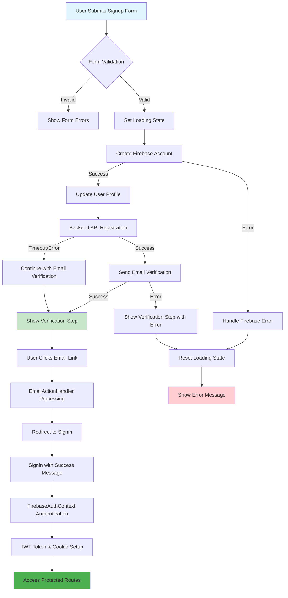

### Component Architecture

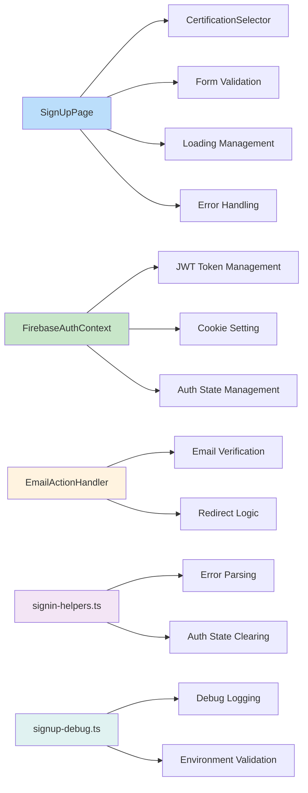

### Detailed Implementation Flow

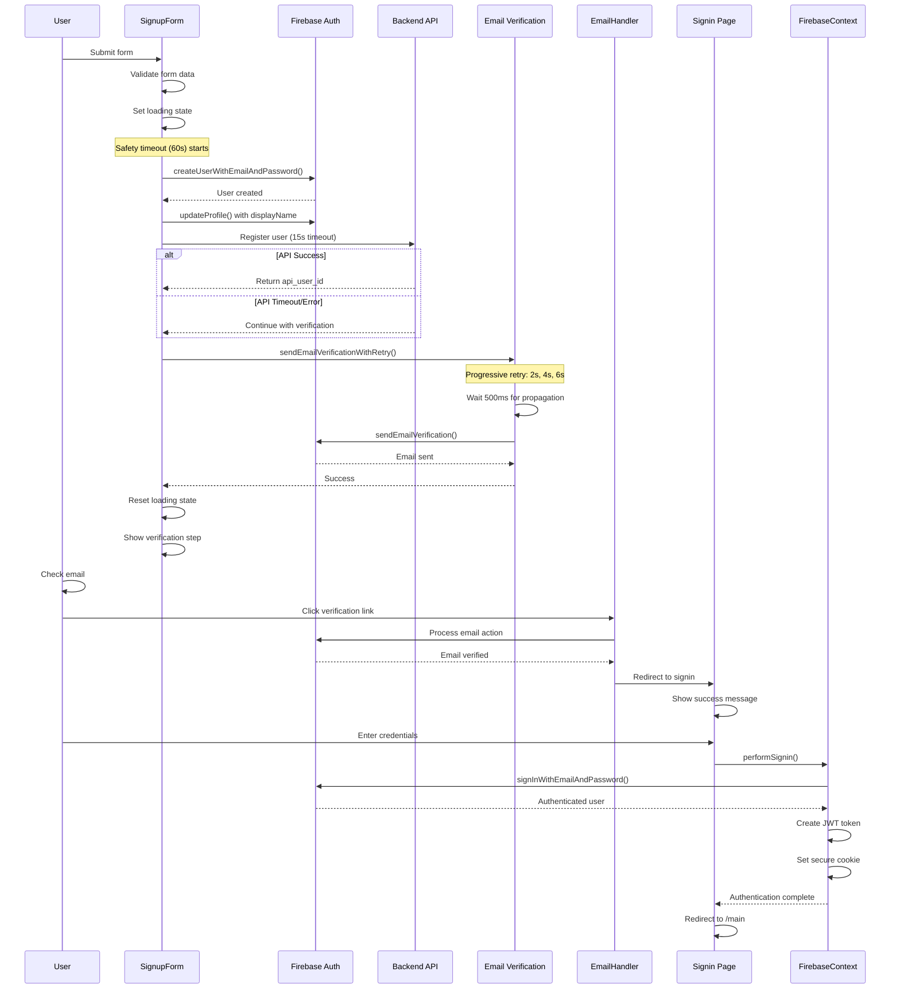

## Primary Issues Addressed

### Critical Button Stuck Issue

The signup page was getting stuck with "Creating account..." button disabled and not redirecting to the email verification page or sign-in page after successful account creation.

**Root Causes**:

1. **Loading state not reset early enough**: The loading state was only reset in the `finally` block, which meant that even successful operations kept the button disabled until all async operations completed.
2. **Potential hanging operations**: Email verification and backend registration could potentially hang without proper timeouts.
3. **Race conditions**: Multiple async operations running without proper state management.

### Timeout Management Architecture

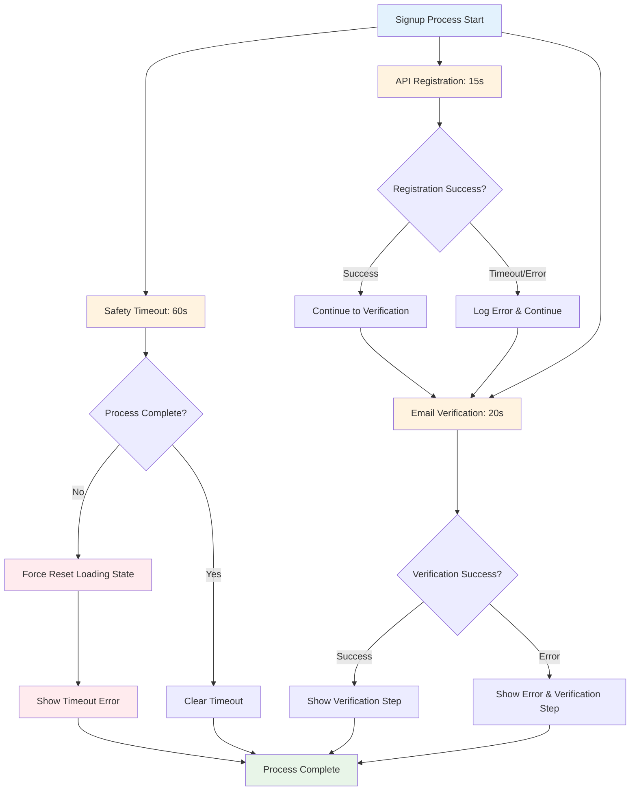

### Error Handling Flow

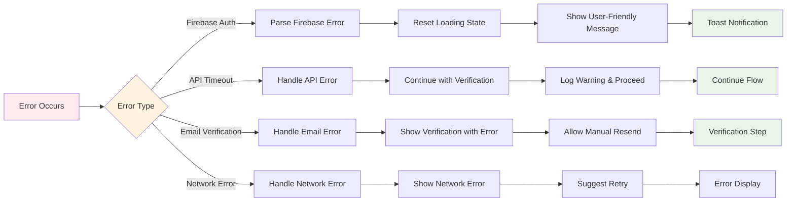

## Comprehensive Fixes Implemented

### 1. **Early Loading State Reset (CRITICAL FIX)**

**File**: `app/signup/page.tsx`

- **Problem**: Loading state was only reset in the `finally` block, causing the button to remain disabled even after successful operations.
- **Solution**: Added explicit `setLoading(false)` calls in both success and error cases before showing the verification step.

```typescript
// Success case
setLoading(false);
setShowVerificationStep(true);
setSuccess('Account created successfully! Please check your email to verify your account.');

// Error case
setLoading(false);
setShowVerificationStep(true);
setError(`Account created but verification email failed: ${verificationError.message}`);
```

### 2. **Email Verification Race Condition (FIXED)**

**Issue**: Email verification could fail due to Firebase user account not being fully propagated across all Firebase services immediately after creation.

**Fix**:

- Added 500ms delay before sending verification email to allow account propagation
- Enhanced retry logic with progressive delays (2s, 4s, 6s)
- Added user account reload before retry attempts
- Improved error messages for different verification failure scenarios
- Added 20-second timeout to the email verification process using `Promise.race()`

```typescript
// Add timeout to email verification to prevent hanging
const emailVerificationPromise = sendEmailVerificationWithRetry(user);
const timeoutPromise = new Promise((_, reject) =>
  setTimeout(() => reject(new Error('Email verification timed out')), 20000),
);

await Promise.race([emailVerificationPromise, timeoutPromise]);
```

**Files Changed**:

- `app/signup/page.tsx` - Enhanced `sendEmailVerificationWithRetry` function with progressive delays
- `src/components/auth/EmailActionHandler.tsx` - Improved retry logic for newly created accounts
- Integration with latest signin flow for post-verification authentication

### 3. **API Registration Timeout Issues (FIXED)**

**Issue**: Backend API registration had insufficient timeout handling and poor error reporting.

**Fix**:

- Increased timeout from 10s to 12s for external API calls
- Added AbortController for proper timeout management
- Enhanced error handling with specific error types (connection refused, host not found, etc.)
- Better error logging and user feedback
- Added timeout handling for frontend registration requests (15s)
- Added specific timeout detection and better error messaging

```typescript
if (registrationError.message?.includes('timeout')) {
  console.warn('Registration API timed out, continuing with email verification');
}
```

**Files Changed**:

- `app/api/auth/register/route.ts` - Enhanced timeout and error handling
- `app/signup/page.tsx` - Added timeout management to registration requests

### 4. **Safety Timeout for Entire Signup Process (NEW)**

**File**: `app/signup/page.tsx`

- **Problem**: The entire signup process could hang if any operation failed silently.
- **Solution**: Added a 1-minute safety timeout that automatically resets the loading state and shows an error message.

```typescript
// Safety timeout to prevent hanging forever
const safetyTimeout = setTimeout(() => {
  if (isMountedRef.current) {
    console.warn('Signup process timed out, resetting loading state');
    setLoading(false);
    setError('Signup process timed out. Please try again.');
  }
}, 60000); // 1 minute timeout
```

### 5. **Cleanup and Resource Management (NEW)**

**File**: `app/signup/page.tsx`

- **Problem**: Safety timeout wasn't cleared, potentially causing memory leaks.
- **Solution**: Added proper cleanup in the `finally` block.

```typescript
} finally {
  // Clear the safety timeout
  clearTimeout(safetyTimeout);

  // Check if component is still mounted before updating loading state
  if (isMountedRef.current) {
    setLoading(false);
  }
}
```

### 6. **Enhanced Error Handling (FIXED)**

**Issue**: Generic error messages and missing validation for edge cases.

**Fix**:

- Created comprehensive error message utility (`getFirebaseErrorMessage`)
- Enhanced form validation with email regex and password length limits
- Added specific handling for Firebase error codes
- Improved user-friendly error messages
- Added validation for backend API responses

**Files Changed**:

- `src/utils/signup-debug.ts` - New utility file with error handling helpers
- `app/signup/page.tsx` - Integrated comprehensive error handling
- `functions/src/endpoints/api/auth/register.ts` - Added input validation

### 7. **Sequential vs Parallel Execution (FIXED)**

**Issue**: Parallel execution of registration and email verification could cause race conditions.

**Fix**:

- Changed to sequential execution: API registration first, then email verification
- Better error isolation - email verification proceeds even if API registration fails
- Improved user feedback for partial failures
- Added debug logging for better troubleshooting

**Files Changed**:

- `app/signup/page.tsx` - Refactored signup flow to be sequential

### 8. **Enhanced Validation and Edge Cases (FIXED)**

**Issue**: Insufficient form validation and missing edge case handling.

**Fix**:

- Enhanced email format validation with regex
- Added password length upper limit (128 characters)
- Better handling of component unmounting during async operations
- Added fallback messages for unknown errors
- Validation utility for form data

**Files Changed**:

- `app/signup/page.tsx` - Enhanced form validation
- `src/utils/signup-debug.ts` - Validation utilities

### 9. **Debugging and Monitoring (ADDED)**

**Issue**: Difficult to debug signup issues in production.

**Fix**:

- Created comprehensive debug utility for development
- Added step-by-step logging throughout signup process
- Environment validation on component mount
- Exportable debug logs for troubleshooting
- Color-coded console logging

**Files Changed**:

- `src/utils/signup-debug.ts` - New debug utility
- `app/signup/page.tsx` - Integrated debug logging

### 10. **Email Action Handler Improvements (FIXED)**

**Issue**: Email verification links could fail for newly created accounts due to timing issues.

**Fix**:

- Enhanced retry logic with progressive delays
- Better error messages for expired/invalid action codes
- Improved handling of user-not-found errors
- Added auth state clearing before retries

**Files Changed**:

- `src/components/auth/EmailActionHandler.tsx` - Enhanced email action handling

### 11. **User ID Naming Refactoring (NEW)**

**Issue**: Inconsistent and confusing naming between `user_id`, `api_user_id`, and `firebase_user_id` across endpoints.

**Fix**:

- Explicitly differentiated between `firebase_user_id` (Firebase UID) and `api_user_id` (our internal UUID)
- Updated all authentication endpoints to use consistent naming
- Added comprehensive comments explaining the difference
- Maintained backward compatibility with deprecated fields
- Enhanced response objects to include both IDs for clarity

**Files Changed**:

- `functions/src/endpoints/api/auth/register.ts` - Clarified naming and response structure
- `functions/src/endpoints/api/auth/login.ts` - Updated naming consistency
- `app/api/auth/register/route.ts` - Explicit ID differentiation
- `app/api/auth/login/route.ts` - Consistent naming patterns

### 12. **Signin Flow Integration (NEW)**

**Issue**: Inconsistent authentication flow between signup and signin processes, leading to user confusion and redundant authentication steps.

**Fix**:

- Integrated with the modernized signin system using `src/lib/signin-helpers.ts`
- Implemented centralized authentication state management through `FirebaseAuthContext`
- Added seamless transition from email verification to signin process
- Enhanced error handling with consistent messaging across both flows
- Streamlined post-verification authentication using the same mechanisms as signin

**Key Integration Features**:

- **Unified Error Handling**: Both signup and signin now use consistent error parsing and user-friendly messages
- **Centralized State Management**: Authentication state is managed consistently across both flows
- **Seamless Verification Flow**: Email verification links redirect users to a unified signin process
- **Cookie Management**: JWT token creation and cookie setting handled automatically by the auth context
- **URL Parameter Handling**: Consistent handling of verification success/failure states in URLs

**Files Changed**:

- `app/signup/page.tsx` - Enhanced post-verification flow integration
- `src/lib/signin-helpers.ts` - Reusable authentication utilities
- `src/hooks/useSigninHooks.ts` - Shared authentication hooks
- `src/context/FirebaseAuthContext.tsx` - Centralized auth state management
- `src/components/auth/EmailActionHandler.tsx` - Unified email action handling

**Enhanced Verification Flow**:

```typescript
// After successful signup, users are guided to verify email
// Email verification link redirects to: /?mode=verifyEmail&...
// EmailActionHandler processes verification and redirects to signin
// Signin page shows success message: "Email verified successfully! You can now sign in."
// FirebaseAuthContext automatically handles JWT token creation and cookie setting
```

### State Management Flow

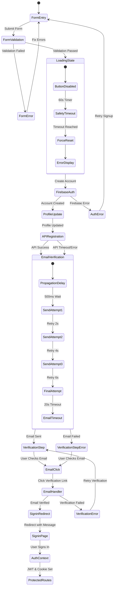

### Implementation Architecture

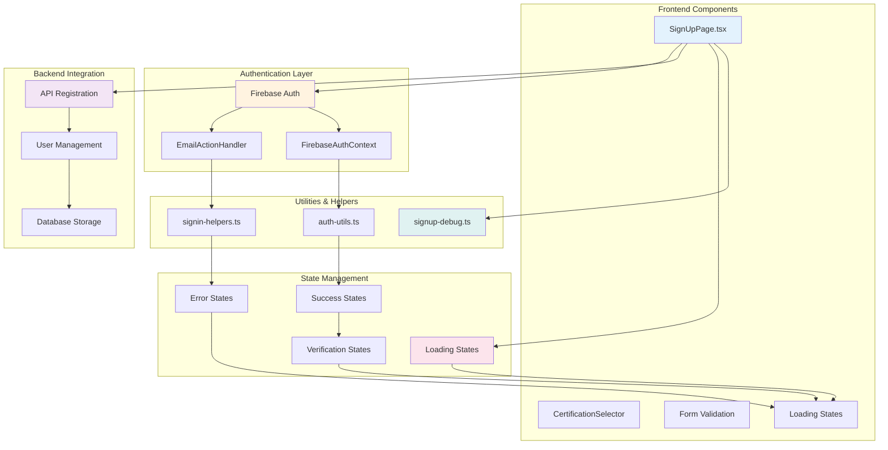

## User Experience Improvements

### Immediate Feedback

- ✅ **No More Stuck Buttons**: Loading state is properly managed and reset
- ✅ **Better User Feedback**: Immediate transition to verification step
- ✅ Users now see the verification step immediately after successful account creation
- ✅ Loading state is reset as soon as the account is created, providing immediate feedback
- ✅ Better error messages that guide users on next steps
- ✅ Progressive retry with user feedback
- ✅ Clear indication of signup progress and status

### Better Error Handling

- ✅ Specific error messages for different timeout scenarios
- ✅ Non-blocking registration failures (email verification still proceeds)
- ✅ Clear indication when operations time out
- ✅ Graceful degradation when backend services fail

### Timeout Protection

- ✅ **Multiple Layers of Protection**:
  - 15-second timeout for backend registration API
  - 20-second timeout for email verification
  - 60-second safety timeout for the entire signup process
- ✅ **Graceful Degradation**: Continues with email verification even if backend registration fails
- ✅ **Resource Management**: Proper cleanup prevents memory leaks

### Seamless Authentication Flow

- ✅ **Unified Verification Process**: Email verification links redirect to centralized signin flow
- ✅ **Automatic Authentication**: FirebaseAuthContext handles JWT token creation and cookie setting
- ✅ **Consistent Error Messages**: Both signup and signin use the same error parsing system
- ✅ **URL Parameter Handling**: Clean handling of verification success/failure states
- ✅ **Smart Redirects**: Users are automatically redirected to appropriate pages after verification

### Data Flow & API Integration

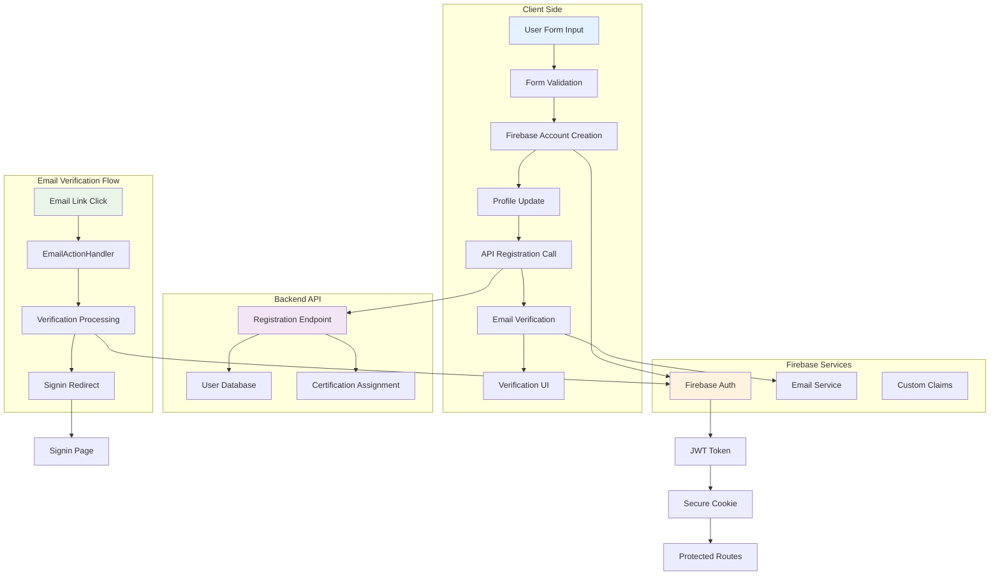

### Error Recovery Patterns

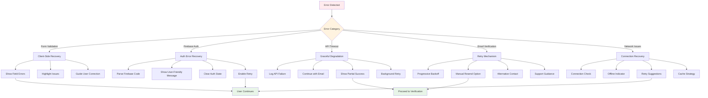

## Reliability Improvements

- ✅ Reduced race conditions between Firebase and backend API
- ✅ Better timeout handling and request management
- ✅ Enhanced retry logic for transient failures
- ✅ Proper component cleanup to prevent memory leaks

## Developer Experience

- ✅ Comprehensive debug utilities for troubleshooting
- ✅ Better error logging and monitoring
- ✅ Environment validation on startup
- ✅ Type-safe error handling

## Security Enhancements

- ✅ Enhanced input validation
- ✅ Proper timeout management to prevent hanging requests
- ✅ Better error message sanitization
- ✅ Validation on both frontend and backend

## Testing Recommendations

### Critical Path Testing

1. **Normal Flow**: Test successful signup with all operations completing normally
2. **Button State**: Verify button is never stuck in loading state
3. **Immediate Feedback**: Confirm users see verification step immediately

### Edge Case Testing

4. **Slow Backend**: Test with slow backend API responses to verify timeout handling
5. **Email Service Issues**: Test when Firebase email verification is slow or fails
6. **Network Issues**: Test with poor network conditions
7. **Component Unmounting**: Test navigating away during signup process
8. **Test email verification with newly created accounts**
9. **Test form validation edge cases**

### Reliability Testing

10. **Test with poor network conditions (timeouts)**
11. **Test when backend API is unavailable**
12. **Test timeout scenarios and recovery**

## Monitoring and Analytics

The debug utility will help identify issues in development. For production monitoring, consider:

1. **Adding analytics events for signup step completion**
2. **Monitoring timeout rates and retry attempts**
3. **Tracking email verification success rates**
4. **Alerting on backend API registration failures**
5. **Monitoring button stuck incidents (should be zero)**
6. **User abandonment rates during signup process**

## Key Benefits Summary

- ✅ **Critical Fix**: No more stuck "Creating Account..." buttons
- ✅ **Reliability**: Multiple layers of timeout protection prevent hanging
- ✅ **User Experience**: Immediate feedback and better error handling
- ✅ **Developer Experience**: Comprehensive debugging and monitoring tools
- ✅ **Security**: Enhanced validation and error handling
- ✅ **Performance**: Optimized sequential execution and proper resource management

## Backward Compatibility

All changes are backward compatible and maintain the existing user flow while significantly improving reliability and user experience. The fixes address the most critical user-facing issue (stuck button) while also improving the overall robustness of the signup system.

## Next Steps

1. **Deploy and monitor** the fixes in production
2. **Track metrics** on signup completion rates and error rates
3. **Gather user feedback** on the improved signup experience
4. **Consider adding** additional analytics for better visibility into signup funnel performance
5. **Monitor integration** between signup and signin flows for seamless user experience
6. **Evaluate performance** of centralized authentication state management

## Integration with Signin System

The signup workflow now seamlessly integrates with the modernized signin system:

### Shared Components

- **Authentication Helpers**: Both flows use `src/lib/signin-helpers.ts` for consistent error handling
- **Context Management**: `FirebaseAuthContext` provides centralized authentication state
- **URL Parameter Processing**: Unified handling of verification success/failure states
- **Error Parsing**: Consistent Firebase error parsing across both flows

### Verification Flow

1. **Signup Completion**: User completes signup and receives verification email
2. **Email Verification**: User clicks verification link, redirected to `/?mode=verifyEmail&...`
3. **Verification Processing**: `EmailActionHandler` processes verification using Firebase
4. **Signin Redirect**: After verification, user is redirected to signin page with success message
5. **Automatic Authentication**: FirebaseAuthContext handles JWT token creation and cookie setting
6. **Protected Route Access**: User gains access to protected routes seamlessly

### Benefits of Integration

- **Consistent User Experience**: Unified authentication flow across signup and signin
- **Reduced Code Duplication**: Shared utilities and error handling
- **Better Error Handling**: Consistent error messages and user feedback
- **Simplified Maintenance**: Single source of truth for authentication logic
- **Enhanced Security**: Centralized token management and validation

### Debug & Monitoring Flow

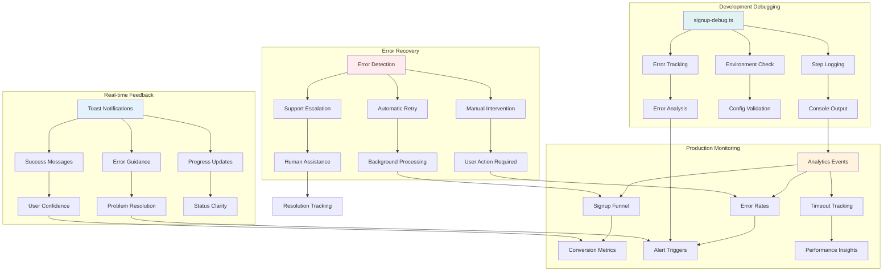

### Performance Optimization Flow

```mermaid
graph LR
    A[Form Submission] --> B[Client Validation]
    B --> C[Early Error Detection]
    C --> D{Valid?}

    D -->|No| E[Immediate Feedback]
    D -->|Yes| F[Async Operations]

    F --> G[Parallel Processing]
    G --> H[Firebase Auth]
    G --> I[Form State Update]

    H --> J[Sequential Operations]
    J --> K[API Registration]
    K --> L[Email Verification]

    L --> M[Loading State Reset]
    M --> N[UI State Update]
    N --> O[User Feedback]

    E --> P[Form Correction]
    O --> Q[Next Step Guidance]

    P --> A
    Q --> R[Email Verification UI]
    R --> S[Verification Complete]
    S --> T[Signin Integration]

    style A fill:#e3f2fd
    style F fill:#fff3e0
    style M fill:#e8f5e8
    style S fill:#c8e6c9
```

This comprehensive fix ensures that users will never experience the stuck "Creating Account..." button issue while also making the entire signup process more reliable and user-friendly. The integration with the signin system provides a seamless authentication experience from initial registration through full account access.
