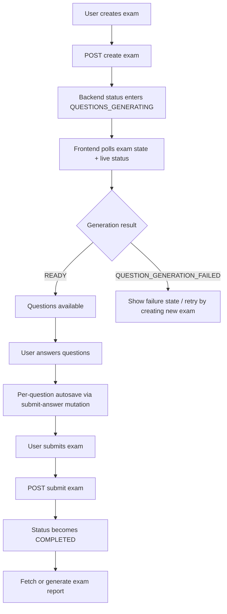

# Exam Lifecycle Workflow

> **Source of truth**: `src/swr/createExam.ts`, `src/swr/exams.ts`, `src/swr/useExamLiveStatus.ts`, `src/swr/useExamGeneratingProgress.ts`, `src/swr/examReport.ts`, `src/swr/questions.ts`, `src/hooks/useExamPageLogic.ts`, `src/hooks/useExamStatusNotifications.ts`, `src/hooks/useExamListGenerationMonitor.ts`, `src/types/exam-status.ts`
> **Last reviewed**: 2026-05-26
> **Owner**: engineering

## Purpose

Documents the end-to-end lifecycle of an exam in `certifai-app`: creation, question generation, readiness, question-answering, submission, and report availability. This is the procedural workflow doc for exam execution behavior; hook signatures and type contracts remain documented in the SWR and data-model docs.

## Key Concepts

- **Exam creation**: authenticated mutation that creates an exam attempt for a certification.
- **Generation phase**: backend question generation window during which the frontend polls for status updates.
- **Ready phase**: questions are generated and the user can begin answering.
- **In-progress phase**: the user is actively answering and paging through exam questions.
- **Completed phase**: the exam is submitted, scored, and eligible for report retrieval/generation.
- **Live status**: real-time generation status from `/live-status`, used for freshness while questions are still being created.

## Workflow Overview

## Lifecycle States

### Backend status sequence

| Backend status               | Meaning                                               | Frontend behavior                                         |
| ---------------------------- | ----------------------------------------------------- | --------------------------------------------------------- |
| `PENDING_QUESTIONS`          | exam record exists but question set is not user-ready | treated as not-started in UI summaries                    |
| `QUESTIONS_GENERATING`       | backend is generating questions                       | poll status every 2 seconds; show generation progress UI  |
| `READY`                      | questions are available and exam is not yet submitted | allow question fetching and exam start                    |
| `IN_PROGRESS`                | exam has started but is not yet submitted             | continue question navigation and autosave                 |
| `COMPLETED`                  | exam was submitted and scored                         | show result/review/report path                            |
| `QUESTION_GENERATION_FAILED` | generation failed                                     | show failure state and instruct user to create a new exam |

### UI-derived states

`src/types/exam-status.ts` maps backend state plus timestamps into user-facing derived states:

- `not_started`
- `ready`
- `generating`
- `generation_failed`
- `in_progress`
- `completed`
- `completed_successful`
- `completed_review`

Use the derived state for labels and badges; use backend status for control flow.

## Hooks Used Across the Lifecycle

| Hook                                               | Stage                                     | Role                                                               |
| -------------------------------------------------- | ----------------------------------------- | ------------------------------------------------------------------ |
| `useCreateExam()`                                  | creation                                  | creates the exam attempt                                           |
| `useExamState()`                                   | generation, ready, in-progress, completed | reads the canonical exam detail record                             |
| `useExamLiveStatus()`                              | generation                                | polls real-time generation status from the live-status endpoint    |
| `useExamGeneratingProgress()`                      | generation                                | deprecated generation poll; preserved for compatibility            |
| `useAllUserExams()` / `useExamsForCertification()` | list views                                | refresh exam lists and counts, including generating entries        |
| `useExamQuestions()`                               | ready, in-progress                        | fetches paginated question pages                                   |
| `useSubmitAnswer()`                                | in-progress                               | autosaves a single question answer                                 |
| `useSubmitExam()`                                  | completion transition                     | submits the full exam                                              |
| `useExamReport()`                                  | completed                                 | fetches an already generated report                                |
| `useGenerateExamReport()`                          | completed                                 | triggers report generation manually                                |
| `useAutoGenerateExamReport()`                      | completed                                 | starts report generation automatically after completion if missing |

## Phase 1: Exam Creation

### Primary hook

- `useCreateExam()` in `src/swr/createExam.ts`

### Request path

- `POST /api/users/:api_user_id/certifications/:cert_id/exams`

### What the frontend expects back

The create-exam response includes:

- `exam_id`
- `api_user_id`
- `cert_id`
- `status`
- `total_questions`
- `token_cost`
- `total_batches`
- `topics_generated`
- `custom_prompt`

### Important creation rules

- The mutation retries once after a `401` by refreshing the auth token.
- Rate-limit errors surface a typed `CreateExamError` with `rateLimitInfo` when the backend returns `429`.
- Creation does **not** mean the exam is ready immediately; the next phase is usually generation polling.

## Phase 2: Question Generation

### Canonical polling hook

- `useExamLiveStatus(apiUserId, examId, pollingEnabled)`

### Legacy hook

- `useExamGeneratingProgress(apiUserId, examId, examStatus)` is deprecated in favor of `useExamLiveStatus()`.

### Polling rules

| Hook                                               | Interval | When polling starts                                                                  | When polling stops                                                     |
| -------------------------------------------------- | -------- | ------------------------------------------------------------------------------------ | ---------------------------------------------------------------------- |
| `useExamLiveStatus()`                              | 2000 ms  | when `pollingEnabled` is true, typically while `examState.exam_status` is generating | when the status is no longer generating or the caller disables polling |
| `useExamGeneratingProgress()`                      | 2000 ms  | when `examStatus === QUESTIONS_GENERATING`                                           | when status becomes `READY` or another terminal state                  |
| `useExamState()`                                   | 2000 ms  | while `exam_status === QUESTIONS_GENERATING`                                         | when exam status is no longer generating                               |
| `useAllUserExams()` / `useExamsForCertification()` | 5000 ms  | only if at least one exam list item is generating                                    | when no generating exams remain                                        |

### UI orchestration

`useExamPageLogic()` combines `useExamState()` and `useExamLiveStatus()`:

1. `useExamState()` provides the canonical exam detail record.
2. `useExamLiveStatus()` provides real-time progress percentage and ETA while generation is active.
3. The hook converts live status into `ExamGenerationProgressUI` for progress widgets.
4. `useExamStatusNotifications()` shows a success toast when generation transitions from `QUESTIONS_GENERATING` to `READY` and an error toast when generation fails.

### Generation completion and failure rules

- Completed transition: `QUESTIONS_GENERATING → READY`
- Failed transition: `QUESTIONS_GENERATING → QUESTION_GENERATION_FAILED`
- Generation completion triggers toast feedback and enables question retrieval.
- Generation failure is treated as terminal for that attempt; the current guidance is to create a new exam.

## Phase 3: Ready and Question Answering

### Question loading

When `apiUserId`, `certId`, and `examId` are available, `useExamPageLogic()` builds a paginated questions URL:

- `/api/users/{apiUserId}/certifications/{certId}/exams/{examId}/questions?page={currentPage}&pageSize={pageSize}`

`useExamQuestions()` then fetches the current page and returns:

- `questions`
- `pagination`
- loading / error state
- `mutateQuestions()` for optimistic updates and revalidation

### Answer submission behavior

`useSubmitAnswer()` performs per-question autosave:

1. The UI optimistically updates the selected option.
2. The hook sends a `PUT` request for the specific question answer.
3. If the request fails, the UI revalidates the question page to roll back to canonical data.
4. Answer-save success/failure is surfaced through toast helpers.

### Navigation behavior

- Question paging is local UI state (`currentPage`) managed by `useExamPageLogic()`.
- Reaching the last page opens a confirm-submit modal rather than submitting immediately.

## Phase 4: Exam Submission

### Primary hook

- `useSubmitExam()` in `src/swr/exams.ts`

### Request path

- `POST /api/users/:api_user_id/certifications/:cert_id/exams/:exam_id/submit`

### Submission behavior

1. `handleConfirmSubmit()` in `useExamPageLogic()` calls `submitExam({ apiUserId, certId, examId, body: {} })`.
2. The mutation retries after token refresh on `401`.
3. On success, the UI stores the result and shows an “exam submitted” toast.
4. The frontend then forces revalidation of:
   - the current exam state,
   - the user’s overall exam list,
   - the certification-specific exam list,
   - the question page data.

### Returned submission data

- `score`
- `tokens_deducted`
- `energy_tokens_awarded`
- `correct_answers`

### Important submission rules

- A `204 No Content` response is normalized into a successful zero-valued payload to keep consumer code stable.
- Submission should be treated as the boundary between answer editing and report availability logic.

## Phase 5: Report Retrieval and Generation

### Primary hooks

- `useExamReport(examId, shouldFetch)`
- `useGenerateExamReport()`
- `useAutoGenerateExamReport(examId, isCompleted, hasReport)`

### Report flow

1. Once an exam is completed, report UI becomes eligible to render.
2. `useExamReport()` tries to fetch `/api/users/{apiUserId}/exams/{examId}/exam-report`.
3. If no report exists yet, `useAutoGenerateExamReport()` waits 2 seconds and triggers generation once.
4. If generation still fails or the report is unavailable, the UI can offer a manual “Generate Report” action.

### Error handling rules

- `EXAM_REPORT_NOT_FOUND` means the report is not available yet and manual generation is allowed.
- `REPORT_GENERATION_TRANSIENT` means generation is already in progress; the UI should wait rather than spam the endpoint.
- 5xx retriable responses are surfaced as temporary delays rather than permanent failures.

## List View Monitoring

Exam lifecycle behavior is not limited to the exam-detail page.

`useExamListGenerationMonitor()` watches exam lists and:

- counts generating exams,
- polls `mutateExams()` every 5 seconds while generation is active,
- forces one final refresh when generating exams disappear from the list.

This keeps dashboards and certification detail pages aligned with background generation progress.

## Practical State Machine Summary

| Step                  | Trigger                     | Main hooks                                                                  | Exit condition                                         |
| --------------------- | --------------------------- | --------------------------------------------------------------------------- | ------------------------------------------------------ |
| Create exam           | user starts a new exam      | `useCreateExam()`                                                           | exam record exists                                     |
| Generate questions    | backend works in background | `useExamState()`, `useExamLiveStatus()`                                     | status becomes `READY` or `QUESTION_GENERATION_FAILED` |
| Start / continue exam | user opens question pages   | `useExamQuestions()`, `useSubmitAnswer()`                                   | user reaches final confirmation                        |
| Submit exam           | user confirms submission    | `useSubmitExam()`                                                           | exam becomes completed and score is available          |
| Load/generate report  | completed exam is viewed    | `useExamReport()`, `useGenerateExamReport()`, `useAutoGenerateExamReport()` | report is available or user sees retry guidance        |

## Dangerous Areas / Anti-patterns

- Do not treat exam creation as synonymous with exam readiness.
- Do not poll indefinitely after the exam leaves a generating state.
- Do not skip exam-list revalidation after submission; dashboard counts and certification lists need the refreshed state.
- Do not duplicate hook signatures or response shapes from the SWR docs into feature components; import the hooks/types instead.
- Do not use the deprecated `useExamGeneratingProgress()` for new work unless a migration constraint requires it.

## Related Docs

- [API: SWR Patterns](../api/swr-patterns.md)
- [Data Models](../data/data-models.md)
- [Client State](../state/client-state.md)
- [Signin Workflow](signin-workflow.md)
