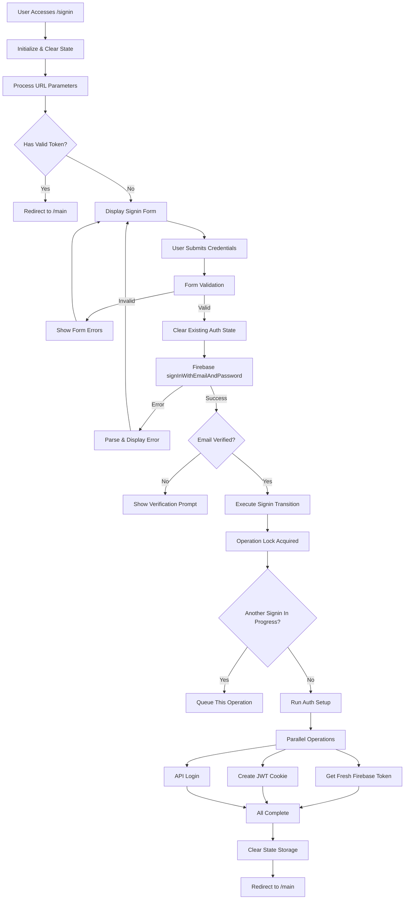
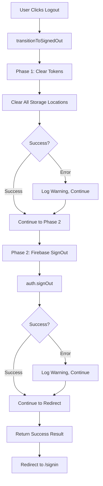

# Signin Workflow

> **Source of truth**: `app/signin/`, `src/context/FirebaseAuthContext.tsx`, `src/lib/auth-state-transitions.ts`, `src/lib/auth-operation-guard.ts`, `app/api/auth-cookie/`
> **Last reviewed**: 2026-05-26
> **Owner**: engineering

## Purpose

Provides the operational, step-by-step lifecycle for signin, token setup, logout, and troubleshooting. This doc is the procedural companion to [`auth-patterns.md`](../security/auth-patterns.md), which remains the invariant/security rule source.

## Key Concepts

- **Signin transition**: the stateful sequence that moves from unauthenticated to authenticated user state.
- **Operation lock**: queue-based guard preventing concurrent signin transitions from corrupting state.
- **Auth cookie**: JOSE-wrapped Firebase token stored as httpOnly cookie.
- **Two-phase logout**: clear client/server token state first, then Firebase sign out.

## Signin Flow

### Complete Signin Process

### Step-by-Step Explanation

1. Initialize signin page and clear legacy auth state.
2. Validate user input.
3. Authenticate with Firebase.
4. Reject unverified emails and surface resend path.
5. Acquire auth operation lock to avoid concurrent transition overlap.
6. Execute auth setup in parallel:
   - force-refresh Firebase token
   - set auth cookie via `/api/auth-cookie/set`
   - perform API login to resolve `api_user_id`
7. Clear transitional storage and redirect to `/main`.

### Error Handling

- Invalid credentials → user-facing retry message.
- Too many requests → throttle/rate-limit message.
- Network errors → retry guidance.
- Unverified email → explicit verification path.

## Logout Flow

### Complete Logout Process

### Step-by-Step Explanation

1. Clear all auth state across cookie + storage + cache paths.
2. Attempt Firebase signout.
3. Redirect to `/signin` even if partial cleanup errors occurred.

### Error Recovery and Emergency Logout

- Logout response may include failed phases for debugging.
- Emergency logout can trigger async cleanup and immediate redirect if normal path hangs.

## Token Lifecycle and Cookie Behavior

### Token Lifecycle

- Signin mints/refreshes Firebase token.
- Token is wrapped and set in httpOnly cookie.
- Auto-refresh runs on interval, but skips auth pages.
- Invalid/expired state triggers session recovery or forced signin.

### Why refresh is skipped on auth pages

Skipping refresh on `/signin` and related auth pages avoids race conditions with ongoing auth transitions.

### Cookie notes

- Cookie stores JOSE payload containing Firebase token and replay-protection fields.
- Cookie policy differs by environment (`secure` behavior and domain constraints).
- Cookie lifecycle operations are centralized in `app/api/auth-cookie/*`.

## State Management and Race Conditions

### Type-Safe State Machine

Use explicit auth state enum transitions; do not infer state solely from nullable user objects.

### Unified Token Clearing

Use `clearAuthTokens(scope)` with explicit scope (`all`, `client`, `cookies`, `storage`) rather than ad-hoc clearing calls.

### Verification State

Verification state is centralized under auth verification helpers to avoid scattered local/session storage keys.

### Race Condition Prevention

Concurrent signin clicks are serialized via operation lock + queue semantics:

1. First request acquires lock.
2. Subsequent requests queue.
3. Queue drains sequentially after completion.

## Route Protection

- `/signin`: redirect authenticated users to `/main`.
- `/main/*`: guarded by middleware JWT validation.

## Error Types and Recovery

| Error | Typical cause | Recovery |
| ---------------------- | ---------------------- | ----------------------------- |
| Invalid email/password | credential mismatch | retry signin |
| Too many attempts | rate limiting | wait/reset password |
| Network failure | connectivity/API issue | retry with connectivity check |
| Email not verified | verification pending | resend verification |
| Session expired | token refresh failure | sign in again |

## File Reference

- `src/context/FirebaseAuthContext.tsx`
- `src/lib/auth-state-manager.ts`
- `src/lib/auth-state-transitions.ts`
- `src/lib/auth-operation-guard.ts`
- `src/lib/auth-verification-state.ts`
- `src/lib/logout-utils.ts`
- `app/api/auth-cookie/*`

## Testing Checklist

### Signin path

- [ ] Verified-email signin redirects to `/main`
- [ ] Invalid credentials surface mapped errors
- [ ] Unverified email triggers verification UX
- [ ] Rapid repeated submits stay consistent (no state corruption)

### Logout path

- [ ] Logout clears state and redirects to `/signin`
- [ ] Partial phase failures still result in signed-out state
- [ ] Emergency logout path avoids hanging session

### Token/cookie path

- [ ] Cookie set on signin with expected shape/lifetime
- [ ] Refresh behavior skips auth pages
- [ ] Expired/revoked token forces clean recovery

## Troubleshooting

### User can’t signin after signup

- Check email verification status.
- Resend verification if needed.

### Stuck auth loading state

- Check API user ID resolution path and timeout logs.

### Auth operations overlap

- Check operation-guard logs for queue/lock behavior.

### Cookie missing or invalid

- Confirm `/api/auth-cookie/set` response and cookie policy (`secure`, domain, secret config).

## Related Docs

- [Auth Patterns](../security/auth-patterns.md)
- [Signup Workflow](signup-workflow.md)
- [API Connection](../api/api-connection.md)
- [Client State](../state/client-state.md)
